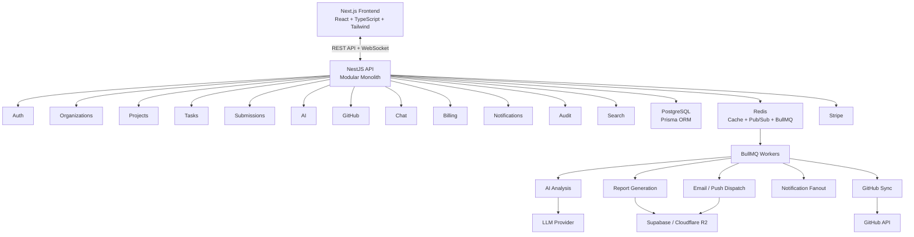

# WorkPulse AI — System Architecture

Status: Draft v1.0
Related: `PROJECT_OVERVIEW.md`, `PRODUCT_REQUIREMENTS_DOCUMENT.md`, `DATABASE_SCHEMA.md`

---

## 1. Architectural Style

- **Modular monolith at launch, service-ready by design.** A single NestJS application organized into strictly bounded modules (Auth, Organizations, Projects, Tasks, Submissions, AI, GitHub, Chat, Billing, Notifications, Audit). Each module owns its own domain logic and can be extracted into an independent service later without a rewrite.
- **Clean Architecture layering** inside every module: `controller → service → repository`, with `validators/schemas` (Zod/class-validator) and `types` decoupled from persistence.
- **CQRS-lite**: heavy read paths (dashboard, analytics, reports) go through dedicated read services/queries, separate from write/command services, to allow independent optimization (caching, read replicas) later.
- **Event-driven side effects**: writes emit domain events (e.g., `submission.created`, `approval.changed`) consumed by BullMQ workers for AI analysis, notifications, audit logging, and GitHub sync — keeping the request/response path fast.

## 2. High-Level Diagram (Textual)



## 3. Frontend Architecture

- **Framework:** Next.js (App Router), React, TypeScript (strict mode, no `any`).
- **Styling/UI:** Tailwind CSS + shadcn/ui as the base component library; Framer Motion for micro-interactions and page transitions.
- **Server state:** TanStack Query for all API data (caching, retries, optimistic updates on submission/approval actions).
- **Client/UI state:** Zustand for ephemeral UI state (command palette open/closed, active view, filters) — never for server data.
- **Forms & validation:** React Hook Form + Zod schemas shared (where possible) with backend DTOs to keep validation rules in one source of truth.
- **Realtime:** Socket.io client for team feed, chat, live approval status, notifications.
- **Structure:**
```
apps/web/
  app/                # routes (App Router)
  components/         # generic, reusable UI (buttons, cards, tables)
  features/           # feature-scoped UI + hooks (projects/, tasks/, submissions/, ai/, chat/, billing/)
  hooks/              # cross-feature hooks
  lib/                # api client, socket client, query client config
  types/              # shared frontend types
  styles/
  tests/
```
- **Design system:** dark theme, glassmorphism surfaces, rounded corners (consistent radius scale), skeleton loaders for every async view, empty states designed per-module (never blank screens), full keyboard navigation, global Command Palette (`⌘K`).

## 4. Backend Architecture

- **Framework:** NestJS (modules, providers, guards, interceptors, pipes — used as intended, not fought against).
- **API style:** REST for CRUD and queries; WebSocket (Socket.io gateway) for realtime feed/chat/notifications.
- **ORM:** Prisma against PostgreSQL — schema-first, migrations checked into version control.
- **Caching/pub-sub/queues:** Redis backs BullMQ (background jobs) and Socket.io's adapter (for multi-instance realtime scaling), and caches hot read paths (dashboard aggregates, leaderboards) with explicit TTL + invalidation on writes.
- **Structure per module:**
```
apps/api/src/
  modules/
    auth/
      controllers/
      services/
      repositories/
      strategies/        # JWT, GitHub OAuth, Google OAuth
      dto/
    organizations/
    projects/
    tasks/
    submissions/
    ai/
      services/          # scoring, summarization
      providers/         # LLM provider adapter(s)
    github/
      services/          # sync, webhook handlers
    chat/
    notifications/
    billing/
    audit/
    search/
  common/
    guards/              # RBAC, JWT, rate-limit
    interceptors/        # logging, response shaping
    middlewares/
    filters/             # exception handling
  jobs/                  # BullMQ processors
  workers/               # standalone worker entrypoints
  config/
  lib/
  types/
  tests/
```

## 5. Authentication & Authorization

- **AuthN:** JWT access tokens (short-lived) + refresh tokens (rotated, stored hashed), OAuth (GitHub, Google) via Passport strategies, optional TOTP 2FA.
- **AuthZ (RBAC):** Role + permission model resolved per-request via a Nest Guard. Permissions are resource-scoped (org/project/task/submission) — a role is necessary but not sufficient; ownership/membership checks always run server-side.
- **Sessions/devices:** Refresh tokens tied to a device/session record; users can view and revoke sessions; revoking invalidates the refresh token server-side (not just client cookie deletion).
- **Multi-tenancy isolation:** every query is scoped by `organization_id` at the repository layer (never left to the controller to remember) — enforced via a Prisma middleware/base-repository pattern so it's structurally impossible to forget.

## 6. AI Subsystem

- **Trigger:** `submission.created` / `submission.updated` domain event → enqueued BullMQ job (`ai-analysis` queue).
- **Pipeline:**
  1. Gather context (submission text, linked GitHub diff stats, task metadata).
  2. Call LLM provider adapter (abstracted behind an interface so the provider is swappable) for structured scoring (Work Quality, Complexity, Effort, Risk, Documentation, Communication, Code Quality, Overall) and the four summary variants.
  3. Persist results to `ai_analyses` table, versioned against the submission version.
  4. Emit `ai_analysis.completed` event → updates dashboard caches, notifies relevant approvers.
- **AI Manager (conversational):** a query-answering service that translates a manager's natural-language question into a constrained query plan against real aggregate data (not free-form generation) and only then hands the retrieved facts to the LLM for phrasing — preventing hallucinated numbers. Report-generation requests route to the existing report pipeline instead of ad hoc generation.
- **Provider abstraction:** `AIProvider` interface with a primary implementation and a documented fallback provider, so an outage doesn't halt the pipeline (jobs retry with backoff; after N failures, alert + queue for manual reprocessing).

## 7. GitHub Integration

- **Connection:** GitHub App (org-level) preferred over personal OAuth for repo access at org scope; per-user OAuth for identity linking (attributing commits to the right member).
- **Sync:** scheduled + webhook-driven (push, pull_request, pull_request_review events) BullMQ jobs update commits/PRs/reviews incrementally — never a full re-pull unless explicitly requested.
- **Linking:** commits/PRs auto-link to tasks via branch-name conventions (e.g., `task/{taskId}-slug`) with manual override/linking always available.

## 8. Realtime Layer

- Socket.io gateway namespaced per concern (`/feed`, `/chat`, `/notifications`).
- Redis adapter for Socket.io so the gateway scales across multiple API instances.
- Every realtime event is also the source of a persisted record (feed items, chat messages, notifications are never realtime-only — reconnecting clients backfill from the DB).

## 9. Search

- Postgres full-text search (tsvector) for MVP, scoped by org/permissions at query time; abstracted behind a `SearchService` so it can be swapped for a dedicated engine (e.g., Meilisearch/Elasticsearch) at scale without touching callers.

## 10. Storage

- Abstracted `StorageProvider` interface (Supabase Storage or Cloudflare R2 implementation) — upload, signed URL retrieval, delete, versioning metadata stored in Postgres (`files` table), binary in object storage.

## 11. Billing

- Stripe Billing (Customer, Subscription, Invoice) reconciled via webhooks (never trust client-reported plan state); plan/seat/feature entitlements resolved server-side from the current subscription record on every gated request.

## 12. Observability & Reliability

- Structured JSON logging (correlation/request IDs), centralized error tracking, BullMQ dashboard (e.g., Bull Board) for job/queue health, health-check endpoints for uptime monitoring, audit log as an append-only table separate from operational tables.

## 13. Deployment & CI/CD

- **Containerization:** Docker for API, worker, and web; `docker-compose` for local dev (Postgres, Redis included).
- **CI/CD:** GitHub Actions — lint → typecheck → test → build → (on main) deploy; separate pipelines for `web`, `api`, `workers`.
- **Environments:** local → staging → production, with environment-scoped secrets (never committed; managed via platform secret store).
- **Migrations:** Prisma migrations run as a distinct, gated CI/CD step before new app versions roll out.

## 14. Security Controls Summary

RBAC (server-enforced), JWT + rotated refresh tokens, rate limiting (per-IP and per-user), CSRF protection on cookie-based flows, output encoding/CSP (XSS), parameterized queries via Prisma (SQLi), encryption in transit (TLS) and at rest (managed DB encryption + encrypted secrets), 2FA, audit logging of all sensitive actions, session/device management with revocation.

## 15. Scalability Notes

- Stateless API instances behind a load balancer; horizontal scaling via container replicas.
- Read-heavy analytics endpoints backed by Redis-cached aggregates, invalidated on relevant writes.
- Background processing (AI, reports, GitHub sync, notifications) fully decoupled via BullMQ so spikes (e.g., end-of-sprint mass submissions) don't degrade interactive API latency.
- Modular monolith boundaries are drawn along the same lines a future service extraction would use (Auth, AI, GitHub Sync are the most likely first extractions given their distinct scaling/latency profiles).