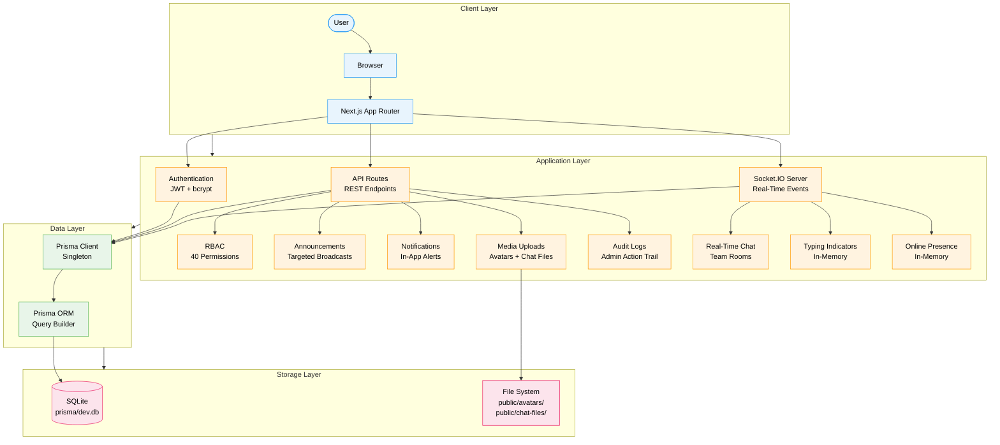
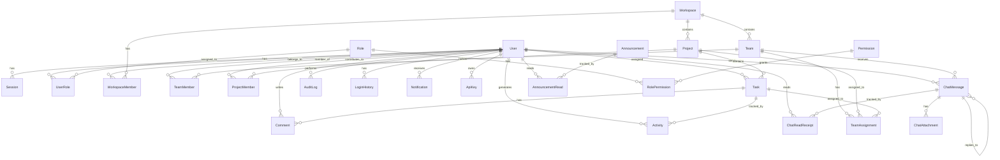
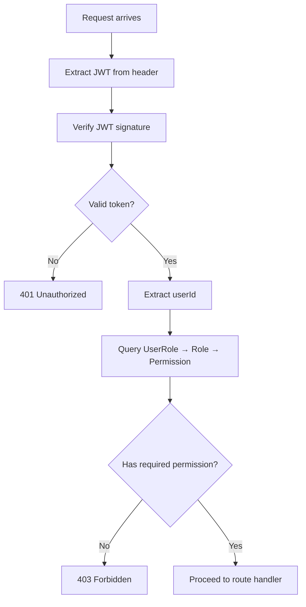
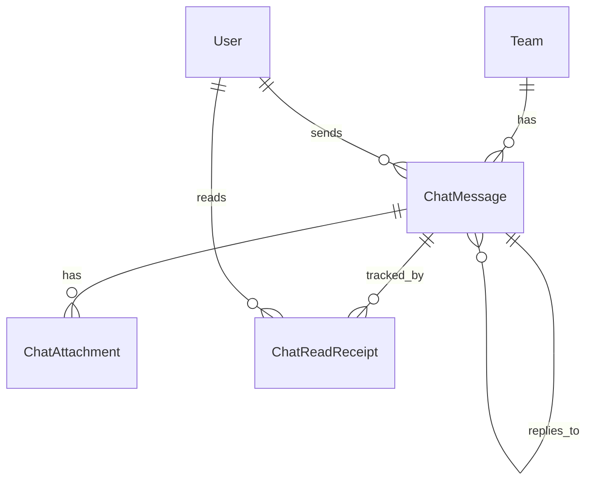

# Database Documentation

Pulse database architecture, schema reference, and operational guidelines.

---

## Table of Contents

- [Database Overview](#database-overview)
- [Database Architecture](#database-architecture)
- [Entity Documentation](#entity-documentation)
- [Relationship Mapping](#relationship-mapping)
- [RBAC Database Design](#rbac-database-design)
- [Chat Database Design](#chat-database-design)
- [Media Storage](#media-storage)
- [Announcement System](#announcement-system)
- [Notification System](#notification-system)
- [Audit Logging](#audit-logging)
- [Activity Tracking](#activity-tracking)
- [Indexing Strategy](#indexing-strategy)
- [Constraints & Validation](#constraints--validation)
- [Transactions](#transactions)
- [Performance](#performance)
- [Security](#security)
- [Backup & Recovery](#backup--recovery)
- [Database Migrations](#database-migrations)
- [Environment Variables](#environment-variables)
- [Future Scalability](#future-scalability)
- [Appendix](#appendix)

---

## Database Overview

| Property | Value |
|---|---|
| **Engine** | SQLite |
| **ORM** | Prisma 6.19.3 |
| **Client** | `@prisma/client` |
| **Connection** | File-based (`file:./dev.db`) |
| **Generator** | `prisma-client-js` |
| **Location** | `prisma/dev.db` (relative to project root) |

### Connection Strategy

The Prisma client is instantiated as a singleton in `src/lib/db.ts` to prevent connection exhaustion during development hot-reloads:

```typescript
const globalForPrisma = globalThis as unknown as { prisma: PrismaClient };
export const db = globalForPrisma.prisma || new PrismaClient();
if (process.env.NODE_ENV !== "production") globalForPrisma.prisma = db;
```

In production, a fresh `PrismaClient` is created per process. In development, the singleton is cached on `globalThis` to survive module re-evaluation.

### Naming Conventions

| Element | Convention | Example |
|---|---|---|
| Models | PascalCase | `ChatMessage`, `TeamAssignment` |
| Fields | camelCase | `userId`, `createdAt`, `forcePasswordReset` |
| Tables (SQLite) | Model name (Prisma default) | `User`, `ChatMessage`, `AuditLog` |
| Indexes | Auto-generated by Prisma | `_adminId`, `_action`, `_resource`, `_createdAt` |
| Unique constraints | `@@unique([field1, field2])` | `@@unique([roleId, permissionId])` |

### Overall Architecture

Pulse uses a single-database, single-process architecture. SQLite is embedded within the Node.js process — no separate database server is required. The database file (`prisma/dev.db`) persists on the local filesystem.

---

## Database Architecture

### High-Level Design



### Entity Relationship Overview



### Data Ownership

| Entity | Owner | Scope | Lifetime |
|---|---|---|---|
| `User` | Self / Admin | Global | Persistent |
| `Session` | User | Per-user | Expires (7 days) |
| `Workspace` | Creator (implicit) | Global | Persistent |
| `Team` | Workspace | Per-workspace | Persistent |
| `Project` | Owner | Per-workspace | Persistent |
| `Task` | Assigner | Per-project | Persistent |
| `ChatMessage` | Author | Per-team | Persistent |
| `ChatAttachment` | Message author | Per-message | Persistent |
| `AuditLog` | System (append-only) | Global | Persistent |
| `Notification` | Recipient | Per-user | Persistent |
| `Announcement` | Author | Global | Persistent until expired |
| `Activity` | User | Per-user | Persistent |
| `RateLimit` | System | Per-key | Time-windowed |

---

## Entity Documentation

### User

**Purpose:** Core identity model. Stores authentication credentials, profile data, avatar metadata, and account status.

| Field | Type | Required | Default | Notes |
|---|---|---|---|---|
| `id` | String (CUID) | Yes | `cuid()` | Primary key |
| `email` | String | Yes | — | Unique |
| `name` | String | Yes | — | Display name |
| `password` | String | Yes | — | bcrypt hash (12 rounds) |
| `avatar` | String? | No | — | Deprecated: use `avatarUrl` |
| `avatarUrl` | String? | No | — | Public URL to avatar image |
| `avatarFileName` | String? | No | — | Original file name |
| `avatarMimeType` | String? | No | — | MIME type (image/jpeg, etc.) |
| `avatarSize` | Int? | No | — | File size in bytes |
| `avatarUploadedAt` | DateTime? | No | — | Last upload timestamp |
| `role` | String | Yes | `"member"` | Legacy role field |
| `status` | String | Yes | `"active"` | `active` \| `suspended` \| `pending` |
| `emailVerified` | Boolean | Yes | `false` | Email verification flag |
| `lastLoginAt` | DateTime? | No | — | Last successful login |
| `loginAttempts` | Int | Yes | `0` | Failed login counter |
| `lockedUntil` | DateTime? | No | — | Account lockout expiry |
| `forcePasswordReset` | Boolean | Yes | `false` | Force reset on next login |
| `createdAt` | DateTime | Yes | `now()` | Account creation |
| `updatedAt` | DateTime | Yes | `@updatedAt` | Last modification |

**Relationships:** User has many Workspaces, Projects, Tasks, Comments, Activities, Notifications, AuditLogs, LoginHistory, UserRoles, ApiKeys, Announcements, Sessions, TeamMemberships, ProjectMemberships, ChatMessages, ChatReadReceipts, AnnouncementReads.

**Business Rules:**
- Email is unique across the system
- Password is bcrypt-hashed, never stored in plaintext
- `role` field is a legacy field; RBAC uses `UserRole` model
- `loginAttempts` increments on failed login; resets on success
- `lockedUntil` is set 30 minutes after 5th failed attempt
- `forcePasswordReset` is set on bootstrap admin; cleared after password change
- Avatar metadata supports JPEG, PNG, WEBP up to 5MB

---

### Session

**Purpose:** Tracks active user sessions for validation and management.

| Field | Type | Required | Default | Notes |
|---|---|---|---|---|
| `id` | String (CUID) | Yes | `cuid()` | Primary key |
| `userId` | String | Yes | — | FK → User |
| `token` | String | Yes | — | Unique JWT token |
| `ipAddress` | String? | No | — | Client IP |
| `userAgent` | String? | No | — | Browser user agent |
| `lastActiveAt` | DateTime | Yes | `now()` | Last activity |
| `expiresAt` | DateTime | Yes | — | Token expiry |
| `createdAt` | DateTime | Yes | `now()` | Session creation |

**Relationships:** Belongs to User (cascade delete).

**Business Rules:**
- Token is unique; one session per token
- Expired sessions should be cleaned up periodically
- `lastActiveAt` updated on each request

---

### Role

**Purpose:** Defines named roles within the RBAC system.

| Field | Type | Required | Default | Notes |
|---|---|---|---|---|
| `id` | String (CUID) | Yes | `cuid()` | Primary key |
| `name` | String | Yes | — | Unique role identifier |
| `description` | String? | No | — | Human-readable description |
| `isSystem` | Boolean | Yes | `false` | System roles cannot be deleted |
| `isDefault` | Boolean | Yes | `false` | Default role for new users |
| `createdAt` | DateTime | Yes | `now()` | Role creation |
| `updatedAt` | DateTime | Yes | `@updatedAt` | Last modification |

**Relationships:** Has many RolePermissions, UserRoles.

**Business Rules:**
- System roles (`isSystem: true`) cannot be deleted
- Only one role can be default (`isDefault: true`)
- 6 system roles seeded: super_admin, admin, manager, team_lead, member, viewer

---

### Permission

**Purpose:** Defines granular permissions using `module:action` naming.

| Field | Type | Required | Default | Notes |
|---|---|---|---|---|
| `id` | String (CUID) | Yes | `cuid()` | Primary key |
| `name` | String | Yes | — | Unique, format: `module:action` |
| `module` | String | Yes | — | e.g., `users`, `projects`, `system` |
| `action` | String | Yes | — | e.g., `create`, `edit`, `view` |
| `description` | String? | No | — | Human-readable description |
| `createdAt` | DateTime | Yes | `now()` | Permission creation |

**Relationships:** Has many RolePermissions.

**Business Rules:**
- 40 permissions seeded across 10 modules
- Naming convention: `module:action` (e.g., `users:create`)
- Permissions are immutable once created (no update/delete in normal operation)

---

### RolePermission

**Purpose:** Many-to-many join between Role and Permission.

| Field | Type | Required | Default | Notes |
|---|---|---|---|---|
| `id` | String (CUID) | Yes | `cuid()` | Primary key |
| `roleId` | String | Yes | — | FK → Role (cascade delete) |
| `permissionId` | String | Yes | — | FK → Permission (cascade delete) |

**Constraints:** `@@unique([roleId, permissionId])`

**Business Rules:**
- Each role-permission pair is unique
- Cascade delete: removing a role or permission removes the mapping

---

### UserRole

**Purpose:** Many-to-many join between User and Role.

| Field | Type | Required | Default | Notes |
|---|---|---|---|---|
| `id` | String (CUID) | Yes | `cuid()` | Primary key |
| `userId` | String | Yes | — | FK → User (cascade delete) |
| `roleId` | String | Yes | — | FK → Role (cascade delete) |
| `createdAt` | DateTime | Yes | `now()` | Assignment date |

**Constraints:** `@@unique([userId, roleId])`

**Business Rules:**
- A user can have multiple roles (union of permissions)
- A user can have at most one instance of each role
- Cascade delete: removing a user or role removes the assignment

---

### Workspace

**Purpose:** Top-level organizational container grouping teams and projects.

| Field | Type | Required | Default | Notes |
|---|---|---|---|---|
| `id` | String (CUID) | Yes | `cuid()` | Primary key |
| `name` | String | Yes | — | Workspace name |
| `slug` | String | Yes | — | Unique URL-friendly identifier |
| `icon` | String? | No | — | Workspace icon |
| `status` | String | Yes | `"active"` | `active` \| `archived` |
| `createdAt` | DateTime | Yes | `now()` | Creation date |
| `updatedAt` | DateTime | Yes | `@updatedAt` | Last modification |

**Relationships:** Has many WorkspaceMembers, Projects, Teams.

**Business Rules:**
- Slug is unique; used for URL routing
- Created automatically on user registration
- A user's first workspace is created with `role: "owner"`

---

### WorkspaceMember

**Purpose:** Links users to workspaces with a role.

| Field | Type | Required | Default | Notes |
|---|---|---|---|---|
| `id` | String (CUID) | Yes | `cuid()` | Primary key |
| `role` | String | Yes | `"member"` | `owner` \| `admin` \| `member` |
| `createdAt` | DateTime | Yes | `now()` | Membership date |
| `userId` | String | Yes | — | FK → User (cascade delete) |
| `workspaceId` | String | Yes | — | FK → Workspace (cascade delete) |

**Constraints:** `@@unique([userId, workspaceId])`

---

### Team

**Purpose:** Groups users within a workspace for collaboration and chat.

| Field | Type | Required | Default | Notes |
|---|---|---|---|---|
| `id` | String (CUID) | Yes | `cuid()` | Primary key |
| `name` | String | Yes | — | Team name |
| `description` | String? | No | — | Team description |
| `status` | String | Yes | `"active"` | `active` \| `archived` |
| `createdAt` | DateTime | Yes | `now()` | Creation date |
| `updatedAt` | DateTime | Yes | `@updatedAt` | Last modification |
| `workspaceId` | String | Yes | — | FK → Workspace (cascade delete) |

**Relationships:** Has many TeamMembers, TeamAssignments, ChatMessages.

---

### TeamMember

**Purpose:** Links users to teams with a role.

| Field | Type | Required | Default | Notes |
|---|---|---|---|---|
| `id` | String (CUID) | Yes | `cuid()` | Primary key |
| `role` | String | Yes | `"member"` | `member` \| `lead` |
| `createdAt` | DateTime | Yes | `now()` | Membership date |
| `userId` | String | Yes | — | FK → User (cascade delete) |
| `teamId` | String | Yes | — | FK → Team (cascade delete) |

**Constraints:** `@@unique([userId, teamId])`

**Business Rules:**
- Team leads can pin/delete chat messages
- New members inherit active TeamAssignments

---

### ChatMessage

**Purpose:** Stores real-time chat messages within teams.

| Field | Type | Required | Default | Notes |
|---|---|---|---|---|
| `id` | String (CUID) | Yes | `cuid()` | Primary key |
| `content` | String | Yes | — | Message text (can be empty for media-only) |
| `type` | String | Yes | `"text"` | `text` \| `system` \| `media` |
| `editedAt` | DateTime? | No | — | Edit timestamp (15-min window) |
| `pinned` | Boolean | Yes | `false` | Pinned status |
| `pinnedAt` | DateTime? | No | — | Pin timestamp |
| `replyToId` | String? | No | — | FK → ChatMessage (self-referential) |
| `createdAt` | DateTime | Yes | `now()` | Send timestamp |
| `teamId` | String | Yes | — | FK → Team (cascade delete) |
| `userId` | String | Yes | — | FK → User (cascade delete) |
| `pinnedBy` | String? | No | — | FK → User (SetNull on delete) |

**Relationships:** Belongs to Team, User. Has many ChatReadReceipts, ChatAttachments. Self-referential: `replyTo` (parent), `replies` (children). Belongs to `pinner` (User).

**Business Rules:**
- Edit window: 15 minutes from `createdAt`
- Delete allowed by: author, admin, super_admin, or team lead
- Pin allowed by: admin, super_admin, or team lead
- Empty content allowed if attachments exist

---

### ChatAttachment

**Purpose:** Stores file metadata for chat message attachments.

| Field | Type | Required | Default | Notes |
|---|---|---|---|---|
| `id` | String (CUID) | Yes | `cuid()` | Primary key |
| `fileName` | String | Yes | — | Server-generated file name |
| `originalName` | String | Yes | — | Original upload file name |
| `mimeType` | String | Yes | — | MIME type |
| `fileSize` | Int | Yes | — | Size in bytes |
| `fileType` | String | Yes | — | `image` \| `video` \| `audio` \| `document` |
| `url` | String | Yes | — | Public URL to file |
| `thumbnailUrl` | String? | No | — | Thumbnail URL (for images/videos) |
| `duration` | Int? | No | — | Duration in seconds (audio/video) |
| `width` | Int? | No | — | Image/video width in pixels |
| `height` | Int? | No | — | Image/video height in pixels |
| `createdAt` | DateTime | Yes | `now()` | Upload timestamp |
| `messageId` | String? | No | — | FK → ChatMessage (SetNull on delete) |

**Business Rules:**
- Max file size: 5MB
- Supported types: JPEG, PNG, GIF, WEBP, MP4, WebM, MP3, WAV, OGG, PDF, DOC, DOCX, XLS, XLSX, TXT, ZIP
- `messageId` is null until the message is sent (upload-before-send pattern)
- Files stored at `public/chat-files/{teamId}/`

---

### ChatReadReceipt

**Purpose:** Tracks which users have read which messages.

| Field | Type | Required | Default | Notes |
|---|---|---|---|---|
| `id` | String (CUID) | Yes | `cuid()` | Primary key |
| `readAt` | DateTime | Yes | `now()` | Read timestamp |
| `messageId` | String | Yes | — | FK → ChatMessage (cascade delete) |
| `userId` | String | Yes | — | FK → User (cascade delete) |

**Constraints:** `@@unique([messageId, userId])`

**Business Rules:**
- One receipt per user per message
- Cascade delete: removing a message removes all receipts

---

### TeamAssignment

**Purpose:** Tracks project and task assignments at the team level.

| Field | Type | Required | Default | Notes |
|---|---|---|---|---|
| `id` | String (CUID) | Yes | `cuid()` | Primary key |
| `type` | String | Yes | — | `"project"` \| `"task"` |
| `status` | String | Yes | `"active"` | `active` \| `completed` \| `removed` |
| `assignedBy` | String | Yes | — | userId of admin who made the assignment |
| `createdAt` | DateTime | Yes | `now()` | Assignment date |
| `updatedAt` | DateTime | Yes | `@updatedAt` | Last modification |
| `teamId` | String | Yes | — | FK → Team (cascade delete) |
| `projectId` | String? | No | — | FK → Project (cascade delete) |
| `taskId` | String? | No | — | FK → Task (cascade delete) |

**Constraints:** `@@unique([teamId, projectId])`, `@@unique([teamId, taskId])`

**Business Rules:**
- A team can be assigned to many projects and tasks
- When assigned, all current members inherit the assignment
- New members added to the team inherit active assignments
- `type` field discriminates between project and task assignments

---

### Project

**Purpose:** Work containers that hold tasks and team assignments.

| Field | Type | Required | Default | Notes |
|---|---|---|---|---|
| `id` | String (CUID) | Yes | `cuid()` | Primary key |
| `name` | String | Yes | — | Project name |
| `description` | String? | No | — | Project description |
| `color` | String | Yes | `"#6366f1"` | Hex color for visual ID |
| `icon` | String? | No | — | Project icon |
| `status` | String | Yes | `"active"` | `active` \| `archived` \| `deleted` |
| `createdAt` | DateTime | Yes | `now()` | Creation date |
| `updatedAt` | DateTime | Yes | `@updatedAt` | Last modification |
| `workspaceId` | String | Yes | — | FK → Workspace (cascade delete) |
| `ownerId` | String | Yes | — | FK → User (cascade delete) |

**Relationships:** Belongs to Workspace, User (owner). Has many Tasks, ProjectMembers, TeamAssignments.

---

### ProjectMember

**Purpose:** Links users to projects with a role.

| Field | Type | Required | Default | Notes |
|---|---|---|---|---|
| `id` | String (CUID) | Yes | `cuid()` | Primary key |
| `role` | String | Yes | `"member"` | `member` \| `admin` |
| `createdAt` | DateTime | Yes | `now()` | Membership date |
| `userId` | String | Yes | — | FK → User (cascade delete) |
| `projectId` | String | Yes | — | FK → Project (cascade delete) |

**Constraints:** `@@unique([userId, projectId])`

---

### Task

**Purpose:** Individual work items within projects.

| Field | Type | Required | Default | Notes |
|---|---|---|---|---|
| `id` | String (CUID) | Yes | `cuid()` | Primary key |
| `title` | String | Yes | — | Task title |
| `description` | String? | No | — | Task description |
| `status` | String | Yes | `"todo"` | `todo` \| `in_progress` \| `in_review` \| `done` |
| `priority` | String | Yes | `"medium"` | `low` \| `medium` \| `high` \| `urgent` |
| `dueDate` | DateTime? | No | — | Due date |
| `position` | Int | Yes | `0` | Kanban ordering position |
| `createdAt` | DateTime | Yes | `now()` | Creation date |
| `updatedAt` | DateTime | Yes | `@updatedAt` | Last modification |
| `projectId` | String | Yes | — | FK → Project (cascade delete) |
| `assigneeId` | String? | No | — | FK → User (SetNull on delete) |

**Relationships:** Belongs to Project, User (assignee). Has many Comments, Activities, TeamAssignments.

**Business Rules:**
- 4 statuses map to Kanban columns
- `position` determines ordering within a column
- Assigning a user is optional

---

### Comment

**Purpose:** Threaded discussion on tasks.

| Field | Type | Required | Default | Notes |
|---|---|---|---|---|
| `id` | String (CUID) | Yes | `cuid()` | Primary key |
| `content` | String | Yes | — | Comment text |
| `createdAt` | DateTime | Yes | `now()` | Creation date |
| `updatedAt` | DateTime | Yes | `@updatedAt` | Last modification |
| `taskId` | String | Yes | — | FK → Task (cascade delete) |
| `userId` | String | Yes | — | FK → User (cascade delete) |

---

### Activity

**Purpose:** Tracks user actions across the platform.

| Field | Type | Required | Default | Notes |
|---|---|---|---|---|
| `id` | String (CUID) | Yes | `cuid()` | Primary key |
| `type` | String | Yes | — | Activity type (e.g., `task.created`) |
| `details` | String? | No | — | Additional details |
| `createdAt` | DateTime | Yes | `now()` | Activity timestamp |
| `taskId` | String? | No | — | FK → Task (SetNull on delete) |
| `userId` | String | Yes | — | FK → User (cascade delete) |

---

### AuditLog

**Purpose:** Append-only trail of all admin mutations with before/after state.

| Field | Type | Required | Default | Notes |
|---|---|---|---|---|
| `id` | String (CUID) | Yes | `cuid()` | Primary key |
| `adminId` | String | Yes | — | FK → User (cascade delete) |
| `action` | String | Yes | — | e.g., `user.created`, `role.updated` |
| `resource` | String | Yes | — | e.g., `user`, `role`, `project` |
| `resourceId` | String? | No | — | ID of affected resource |
| `before` | String? | No | — | JSON string of previous state |
| `after` | String? | No | — | JSON string of new state |
| `ipAddress` | String? | No | — | Client IP address |
| `userAgent` | String? | No | — | Browser user agent |
| `device` | String? | No | — | Device type (Desktop/Mobile/Tablet) |
| `createdAt` | DateTime | Yes | `now()` | Action timestamp |

**Indexes:** `adminId`, `action`, `resource`, `createdAt`

**Business Rules:**
- Append-only: no updates or deletes
- `before`/`after` stored as JSON strings
- Every admin mutation generates an entry

---

### LoginHistory

**Purpose:** Records all login attempts (success and failure).

| Field | Type | Required | Default | Notes |
|---|---|---|---|---|
| `id` | String (CUID) | Yes | `cuid()` | Primary key |
| `userId` | String | Yes | — | FK → User (cascade delete) |
| `email` | String | Yes | — | Email used for login |
| `success` | Boolean | Yes | — | Login success flag |
| `ipAddress` | String? | No | — | Client IP |
| `userAgent` | String? | No | — | Browser user agent |
| `device` | String? | No | — | Device type |
| `reason` | String? | No | — | Failure reason (e.g., `invalid_password`, `account_locked`) |
| `createdAt` | DateTime | Yes | `now()` | Attempt timestamp |

**Indexes:** `userId`, `email`

---

### Notification

**Purpose:** In-app notifications for users.

| Field | Type | Required | Default | Notes |
|---|---|---|---|---|
| `id` | String (CUID) | Yes | `cuid()` | Primary key |
| `title` | String | Yes | — | Notification title |
| `message` | String | Yes | — | Notification body |
| `read` | Boolean | Yes | `false` | Read status |
| `type` | String | Yes | `"info"` | `info` \| `warning` \| `error` \| `success` |
| `link` | String? | No | — | Deep link URL |
| `createdAt` | DateTime | Yes | `now()` | Creation timestamp |
| `userId` | String | Yes | — | FK → User (cascade delete) |

---

### FeatureFlag

**Purpose:** Runtime feature toggles managed by administrators.

| Field | Type | Required | Default | Notes |
|---|---|---|---|---|
| `id` | String (CUID) | Yes | `cuid()` | Primary key |
| `name` | String | Yes | — | Unique flag identifier |
| `description` | String? | No | — | Description |
| `enabled` | Boolean | Yes | `false` | Toggle state |
| `createdAt` | DateTime | Yes | `now()` | Creation date |
| `updatedAt` | DateTime | Yes | `@updatedAt` | Last modification |

---

### SystemSetting

**Purpose:** Application configuration stored in the database.

| Field | Type | Required | Default | Notes |
|---|---|---|---|---|
| `id` | String (CUID) | Yes | `cuid()` | Primary key |
| `key` | String | Yes | — | Unique setting key |
| `value` | String | Yes | — | Setting value |
| `category` | String | Yes | `"general"` | `general` \| `auth` \| `email` \| `storage` \| `security` |
| `createdAt` | DateTime | Yes | `now()` | Creation date |
| `updatedAt` | DateTime | Yes | `@updatedAt` | Last modification |

**Seeded Settings:**

| Key | Value | Category |
|---|---|---|
| `site_name` | `Pulse` | general |
| `site_description` | `Team Analytics & Productivity Intelligence` | general |
| `allow_registration` | `true` | auth |
| `require_email_verification` | `false` | auth |
| `max_login_attempts` | `5` | security |
| `lockout_duration_minutes` | `30` | security |
| `session_timeout_hours` | `168` | auth |
| `enable_2fa` | `false` | auth |
| `rate_limit_requests` | `100` | security |
| `rate_limit_window_minutes` | `15` | security |

---

### ApiKey

**Purpose:** API key management for programmatic access.

| Field | Type | Required | Default | Notes |
|---|---|---|---|---|
| `id` | String (CUID) | Yes | `cuid()` | Primary key |
| `name` | String | Yes | — | Key name |
| `key` | String | Yes | — | Unique API key |
| `permissions` | String | Yes | `"read"` | Comma-separated permissions |
| `expiresAt` | DateTime? | No | — | Expiry date |
| `lastUsedAt` | DateTime? | No | — | Last usage |
| `active` | Boolean | Yes | `true` | Active status |
| `createdAt` | DateTime | Yes | `now()` | Creation date |
| `userId` | String | Yes | — | FK → User (cascade delete) |

---

### Announcement

**Purpose:** System-wide or targeted broadcasts from administrators.

| Field | Type | Required | Default | Notes |
|---|---|---|---|---|
| `id` | String (CUID) | Yes | `cuid()` | Primary key |
| `title` | String | Yes | — | Announcement title |
| `message` | String | Yes | — | Announcement body |
| `type` | String | Yes | `"info"` | `info` \| `warning` \| `critical` |
| `active` | Boolean | Yes | `true` | Active status |
| `targetType` | String | Yes | `"everyone"` | `everyone` \| `teams` \| `roles` \| `users` |
| `targetIds` | String | Yes | `"[]"` | JSON array of IDs/names |
| `expiresAt` | DateTime? | No | — | Expiration timestamp |
| `createdAt` | DateTime | Yes | `now()` | Creation date |
| `updatedAt` | DateTime | Yes | `@updatedAt` | Last modification |
| `authorId` | String | Yes | — | FK → User (cascade delete) |

**Relationships:** Belongs to User (author). Has many AnnouncementReads.

**Business Rules:**
- `targetType` determines audience; `targetIds` stores the specific targets as JSON
- `expiresAt` auto-deactivates expired announcements
- Read tracking via `AnnouncementRead`

---

### AnnouncementRead

**Purpose:** Tracks which users have read which announcements.

| Field | Type | Required | Default | Notes |
|---|---|---|---|---|
| `id` | String (CUID) | Yes | `cuid()` | Primary key |
| `announcementId` | String | Yes | — | FK → Announcement (cascade delete) |
| `userId` | String | Yes | — | FK → User (cascade delete) |
| `readAt` | DateTime | Yes | `now()` | Read timestamp |

**Constraints:** `@@unique([announcementId, userId])`

---

### RateLimit

**Purpose:** Database-backed rate limiting counters.

| Field | Type | Required | Default | Notes |
|---|---|---|---|---|
| `id` | String (CUID) | Yes | `cuid()` | Primary key |
| `key` | String | Yes | — | Unique key (e.g., `ip:192.168.1.1`) |
| `count` | Int | Yes | `1` | Request counter |
| `windowStart` | DateTime | Yes | `now()` | Window start timestamp |
| `createdAt` | DateTime | Yes | `now()` | Record creation |

---

## Relationship Mapping

### One-to-One

| Parent | Child | Foreign Key | Description |
|---|---|---|---|
| `User` | `Session` | `Session.token` (unique) | One active session per token |
| `ChatMessage` | `ChatMessage` (reply) | `ChatMessage.replyToId` | A message can reply to one parent |

### One-to-Many

| Parent | Children | Foreign Key | Cascade |
|---|---|---|---|
| `User` | `Session` | `Session.userId` | Cascade |
| `User` | `UserRole` | `UserRole.userId` | Cascade |
| `User` | `WorkspaceMember` | `WorkspaceMember.userId` | Cascade |
| `User` | `TeamMember` | `TeamMember.userId` | Cascade |
| `User` | `ProjectMember` | `ProjectMember.userId` | Cascade |
| `User` | `Task` (assignee) | `Task.assigneeId` | SetNull |
| `User` | `Comment` | `Comment.userId` | Cascade |
| `User` | `Activity` | `Activity.userId` | Cascade |
| `User` | `AuditLog` | `AuditLog.adminId` | Cascade |
| `User` | `LoginHistory` | `LoginHistory.userId` | Cascade |
| `User` | `Notification` | `Notification.userId` | Cascade |
| `User` | `ApiKey` | `ApiKey.userId` | Cascade |
| `User` | `Announcement` | `Announcement.authorId` | Cascade |
| `User` | `ChatMessage` | `ChatMessage.userId` | Cascade |
| `User` | `ChatReadReceipt` | `ChatReadReceipt.userId` | Cascade |
| `Role` | `RolePermission` | `RolePermission.roleId` | Cascade |
| `Role` | `UserRole` | `UserRole.roleId` | Cascade |
| `Permission` | `RolePermission` | `RolePermission.permissionId` | Cascade |
| `Workspace` | `WorkspaceMember` | `WorkspaceMember.workspaceId` | Cascade |
| `Workspace` | `Project` | `Project.workspaceId` | Cascade |
| `Workspace` | `Team` | `Team.workspaceId` | Cascade |
| `Team` | `TeamMember` | `TeamMember.teamId` | Cascade |
| `Team` | `TeamAssignment` | `TeamAssignment.teamId` | Cascade |
| `Team` | `ChatMessage` | `ChatMessage.teamId` | Cascade |
| `Project` | `Task` | `Task.projectId` | Cascade |
| `Project` | `ProjectMember` | `ProjectMember.projectId` | Cascade |
| `Project` | `TeamAssignment` | `TeamAssignment.projectId` | Cascade |
| `Task` | `Comment` | `Comment.taskId` | Cascade |
| `Task` | `Activity` | `Activity.taskId` | SetNull |
| `Task` | `TeamAssignment` | `TeamAssignment.taskId` | Cascade |
| `ChatMessage` | `ChatAttachment` | `ChatAttachment.messageId` | SetNull |
| `ChatMessage` | `ChatReadReceipt` | `ChatReadReceipt.messageId` | Cascade |
| `ChatMessage` | `ChatMessage` (replies) | `ChatMessage.replyToId` | SetNull |
| `Announcement` | `AnnouncementRead` | `AnnouncementRead.announcementId` | Cascade |

### Many-to-Many (via join tables)

| Entity A | Join Table | Entity B | Constraint |
|---|---|---|---|
| `User` | `UserRole` | `Role` | `@@unique([userId, roleId])` |
| `Role` | `RolePermission` | `Permission` | `@@unique([roleId, permissionId])` |
| `User` | `WorkspaceMember` | `Workspace` | `@@unique([userId, workspaceId])` |
| `User` | `TeamMember` | `Team` | `@@unique([userId, teamId])` |
| `User` | `ProjectMember` | `Project` | `@@unique([userId, projectId])` |
| `User` | `AnnouncementRead` | `Announcement` | `@@unique([announcementId, userId])` |
| `User` | `ChatReadReceipt` | `ChatMessage` | `@@unique([messageId, userId])` |

---

## RBAC Database Design

### Architecture

```
User ──┬── UserRole ── Role ── RolePermission ── Permission
       │                           │
       │              ┌────────────┘
       │              │
       └── (legacy) role field ── "member" (default)
```

### Permission Modules

| Module | Permissions | Count |
|---|---|---|
| `users` | view, create, edit, delete, suspend, activate, reset_password, change_role | 8 |
| `roles` | view, create, edit, delete, assign | 5 |
| `projects` | view, create, edit, delete, archive, restore | 6 |
| `tasks` | view, create, edit, delete, assign | 5 |
| `workspaces` | view, create, edit, delete | 4 |
| `teams` | view, manage | 2 |
| `analytics` | view, export | 2 |
| `audit` | view | 1 |
| `system` | settings, health, feature_flags, api_keys, announcements | 5 |
| `activity` | view | 1 |
| `notifications` | manage | 1 |
| **Total** | | **40** |

### Role Permission Counts

| Role | Permissions | Description |
|---|---|---|
| `super_admin` | 40 | Full system access |
| `admin` | 24 | User and project management |
| `manager` | 13 | Project and task management |
| `team_lead` | 8 | Task management and team view |
| `member` | 5 | Standard task operations |
| `viewer` | 5 | Read-only access |

### Authorization Flow



### Permission Cache

Permissions are cached in memory with a 5-minute TTL to reduce database queries. The cache is checked before querying the database, and invalidated on role/permission changes.

---

## Chat Database Design

### Schema



### Message Flow

1. **Upload:** Client uploads file → `ChatAttachment` created (messageId = null)
2. **Send:** Client sends message → `ChatMessage` created → `ChatAttachment.messageId` linked
3. **Broadcast:** Socket.IO emits to team room
4. **Read:** Client marks messages as read → `ChatReadReceipt` upserted
5. **Edit:** Author edits within 15 min → `ChatMessage.content` updated, `editedAt` set
6. **Delete:** Author/admin/lead deletes → `ChatMessage` deleted, receipts cascade
7. **Pin:** Admin/lead pins → `ChatMessage.pinned = true`, `pinnedBy` set

### Typing Indicators

Typing events are **not stored in the database**. They are broadcast in real-time via Socket.IO and exist only in memory on the server.

---

## Media Storage

### Avatar Storage

| Property | Value |
|---|---|
| **Path** | `public/avatars/{userId}-{timestamp}.{ext}` |
| **Max Size** | 5MB |
| **Allowed Types** | JPEG, PNG, WEBP |
| **Server Processing** | Cropped to 400x400px |
| **Cache Headers** | `Cache-Control: public, max-age=0, must-revalidate` |
| **Metadata** | Stored in `User` model: `avatarUrl`, `avatarFileName`, `avatarMimeType`, `avatarSize`, `avatarUploadedAt` |

### Chat File Storage

| Property | Value |
|---|---|
| **Path** | `public/chat-files/{teamId}/{messageId}-{timestamp}-{hash}.{ext}` |
| **Max Size** | 5MB per file |
| **Allowed Types** | Images (JPEG, PNG, GIF, WEBP), Videos (MP4, WebM), Audio (MP3, WAV, OGG), Documents (PDF, DOC, DOCX, XLS, XLSX, TXT, ZIP) |
| **Metadata** | Stored in `ChatAttachment` model |
| **Cleanup** | No automatic cleanup; files persist with their parent message |

### Security

- File names are server-generated to prevent path traversal
- MIME type is validated on upload
- Files are served via Next.js static file serving (no direct filesystem access)

---

## Announcement System

### Storage

Announcements are stored in the `Announcement` model with targeting via `targetType` and `targetIds`:

| targetType | targetIds | Meaning |
|---|---|---|
| `everyone` | `"[]"` | All users |
| `teams` | `["team-id-1", "team-id-2"]` | Specific teams |
| `roles` | `["admin", "manager"]` | Users with specific roles |
| `users` | `["user-id-1"]` | Specific users |

### Read Tracking

- `AnnouncementRead` records per-user read status
- Unique constraint: one read record per user per announcement
- Read status checked via `LEFT JOIN` or separate query

### Expiry

- `expiresAt` field on `Announcement`
- Expired announcements filtered at query time (not deleted)
- Active status: `active = true AND (expiresAt IS NULL OR expiresAt > now())`

---

## Notification System

### Types

| Type | Color | Usage |
|---|---|---|
| `info` | Blue | General information |
| `warning` | Amber | Warning messages |
| `error` | Red | Error notifications |
| `success` | Green | Success confirmations |

### Delivery Model

- Notifications are created server-side and stored in the `Notification` model
- Clients poll `/api/notifications` for unread counts
- Mark all read: PATCH updates all `read = false` to `true` for the user
- Clear all: DELETE removes all notifications for the user
- Deep linking via `link` field

---

## Audit Logging

### What is Logged

Every admin mutation generates an `AuditLog` entry:

| Admin Action | Logged |
|---|---|
| Create user | ✓ |
| Update user | ✓ |
| Delete user | ✓ |
| Suspend/activate user | ✓ |
| Reset password | ✓ |
| Change role | ✓ |
| Create/edit/delete role | ✓ |
| Assign permissions | ✓ |
| Create/edit/delete project | ✓ |
| Create/edit/delete task | ✓ |
| Create/toggle/delete feature flag | ✓ |
| Update system setting | ✓ |
| Create/delete announcement | ✓ |

### Before/After Snapshots

- `before`: JSON string of the resource state before the mutation
- `after`: JSON string of the resource state after the mutation
- Enables rollback analysis and compliance reporting

### Metadata

- `ipAddress`: Client IP from request headers
- `userAgent`: Browser user agent string
- `device`: Parsed device type (Desktop/Mobile/Tablet)

### Retention

- Audit logs are append-only (no updates or deletes)
- No automatic retention policy; logs persist indefinitely
- Recommended: periodic archival for logs older than 1 year

---

## Activity Tracking

Activities are recorded for key user actions:

| Activity Type | Context |
|---|---|
| `task.created` | New task created |
| `task.updated` | Task status/priority/assignee changed |
| `task.completed` | Task moved to `done` status |
| `user.joined` | User registered or joined workspace |
| `project.created` | New project created |
| `comment.added` | Comment added to task |

Activities are linked to users and optionally to tasks. The activity feed is displayed on the dashboard and admin panel.

---

## Indexing Strategy

### Primary Indexes (Automatic)

Every model's `id` field is automatically indexed as the primary key.

### Unique Indexes

| Model | Field(s) | Constraint |
|---|---|---|
| `User` | `email` | `@unique` |
| `Session` | `token` | `@unique` |
| `Role` | `name` | `@unique` |
| `Permission` | `name` | `@unique` |
| `Workspace` | `slug` | `@unique` |
| `FeatureFlag` | `name` | `@unique` |
| `SystemSetting` | `key` | `@unique` |
| `ApiKey` | `key` | `@unique` |
| `RateLimit` | `key` | `@unique` |

### Composite Unique Indexes

| Model | Fields | Purpose |
|---|---|---|
| `RolePermission` | `[roleId, permissionId]` | Prevent duplicate permission assignments |
| `UserRole` | `[userId, roleId]` | Prevent duplicate role assignments |
| `WorkspaceMember` | `[userId, workspaceId]` | Prevent duplicate workspace memberships |
| `TeamMember` | `[userId, teamId]` | Prevent duplicate team memberships |
| `ProjectMember` | `[userId, projectId]` | Prevent duplicate project memberships |
| `ChatReadReceipt` | `[messageId, userId]` | One read receipt per user per message |
| `AnnouncementRead` | `[announcementId, userId]` | One read record per user per announcement |
| `TeamAssignment` | `[teamId, projectId]` | One project assignment per team |
| `TeamAssignment` | `[teamId, taskId]` | One task assignment per team |

### Explicit Indexes

| Model | Field | Purpose |
|---|---|---|
| `AuditLog` | `adminId` | Query audit logs by admin |
| `AuditLog` | `action` | Filter by action type |
| `AuditLog` | `resource` | Filter by resource type |
| `AuditLog` | `createdAt` | Sort/filter by time |
| `LoginHistory` | `userId` | Query login history by user |
| `LoginHistory` | `email` | Query login history by email |

---

## Constraints & Validation

### Required Fields

All models require `id` and timestamps (`createdAt`). Specific required fields are documented per entity above.

### Unique Constraints

- `User.email`: Global uniqueness
- `Session.token`: Global uniqueness
- `Role.name`, `Permission.name`: Global uniqueness
- `Workspace.slug`: Global uniqueness
- All `@@unique` composite constraints listed in Indexing Strategy

### Foreign Key Rules

| Rule | Usage |
|---|---|
| `onDelete: Cascade` | Parent deletion removes all children (e.g., deleting a User removes their Sessions) |
| `onDelete: SetNull` | Parent deletion nullifies the FK (e.g., deleting a User sets `Task.assigneeId` to null) |

### Business Validation

- Password: minimum 8 characters, bcrypt-hashed
- Email: valid format, unique
- File uploads: type whitelist, size limit (5MB)
- Chat messages: content or attachments required
- Task status: must be one of `todo`, `in_progress`, `in_review`, `done`
- Task priority: must be one of `low`, `medium`, `high`, `urgent`

### Soft Delete

Pulse does not use soft delete. Records are physically deleted with cascade rules. The `Project.status` field (`active` | `archived` | `deleted`) provides a logical delete for projects.

---

## Transactions

### Where Transactions Should Be Used

| Operation | Why |
|---|---|
| User registration | Create User + UserRole + Workspace + WorkspaceMember atomically |
| Team creation | Create Team + TeamMember atomically |
| Chat message with attachments | Create ChatMessage + link ChatAttachments atomically |
| Task assignment | Create Task + Activity atomically |
| Announcement publishing | Create Announcement + AnnouncementRead records atomically |
| Role permission update | Delete old RolePermissions + create new ones atomically |

### Current Implementation

Prisma uses SQLite transactions via `$transaction()`. Critical multi-step operations should wrap related writes in a transaction to ensure atomicity.

---

## Performance

### Query Optimization

- **Permission caching:** 5-minute TTL cache for user permissions reduces DB queries
- **Prisma singleton:** Prevents connection exhaustion in development
- **Pagination:** All list endpoints use `skip`/`take` for pagination (20 items per page)
- **Select filtering:** Use Prisma `select` to fetch only needed fields
- **Include optimization:** Avoid deep `include` chains; fetch related data in separate queries when possible

### N+1 Prevention

- Team member lists: use `include: { user: true }` instead of lazy loading
- Chat messages: use `include: { user: true, attachments: true, readReceipts: true }` in bulk
- Audit logs: use `include: { admin: { select: { name: true, email: true } } }`

### Caching Strategy

| Layer | TTL | Scope |
|---|---|---|
| Permission cache | 5 minutes | Per-user |
| Feature flags | No cache (runtime check) | Global |
| System settings | No cache (query on demand) | Global |

---

## Security

### Password Storage

- Hashed with bcrypt, 12 salt rounds
- Never stored in plaintext
- Password history not tracked

### Session Management

- JWT tokens stored in client `sessionStorage`
- Server-side `Session` model tracks active sessions
- 7-day expiry

### SQL Injection Protection

- Prisma ORM uses parameterized queries for all operations
- No raw SQL queries in the application code
- Input validation via Zod schemas before database queries

### File Access

- Avatars served with `Cache-Control: public, max-age=0, must-revalidate`
- Chat files served via Next.js static file serving
- No direct filesystem access from client

---

## Backup & Recovery

### Backup Strategy

| Component | Method | Frequency |
|---|---|---|
| Database | Copy `prisma/dev.db` file | Daily |
| Uploaded files | Copy `public/avatars/` and `public/chat-files/` | Daily |
| Configuration | Version control (`.env.example`) | Continuous |

### Restore Process

1. Stop the application
2. Replace `prisma/dev.db` with the backup
3. Restore `public/avatars/` and `public/chat-files/` if needed
4. Run `npx prisma generate` if schema changed
5. Restart the application

### Disaster Recovery

- SQLite is a single file; backup is straightforward
- No point-in-time recovery (WAL mode can help but is not configured by default)
- Recommended: snapshot the entire project directory

---

## Database Migrations

### Workflow

```bash
# 1. Modify schema.prisma
# 2. Generate Prisma client
npx prisma generate

# 3. Push schema to database (development)
npx prisma db push

# 4. Seed roles, permissions, settings, and bootstrap admin
npm run db:seed

# 5. Reset and reseed (if needed)
npm run db:reset
```

### Versioning

- Schema changes are tracked in `prisma/schema.prisma`
- No formal migration versioning (uses `db push` instead of `migrate dev`)
- For production: use `prisma migrate deploy` with migration files

### Rollback

- `db push` does not support rollback
- For rollback: restore from backup and re-apply migrations
- `db:reset` drops all data and re-seeds

### Seed Data

The seed script (`prisma/seed.ts`) creates:
- 40 permissions across 10 modules
- 6 system roles with permission assignments
- 10 system settings
- 4 feature flags
- 1 bootstrap Super Admin account (if none exists)

---

## Environment Variables

| Variable | Required | Default | Description |
|---|---|---|---|
| `DATABASE_URL` | Yes | `file:./dev.db` | SQLite connection string |

---

## Future Scalability

### Current Limitations

| Limitation | Impact |
|---|---|
| SQLite single-writer | No concurrent write scaling |
| File-based storage | No CDN, no distributed storage |
| Single-process | No horizontal scaling without external LB |
| In-memory Socket.IO state | Online presence lost on restart |

### Migration Path

| Need | Solution |
|---|---|
| Concurrent writes | Migrate to PostgreSQL |
| Horizontal scaling | Add external load balancer, shared database |
| File storage | Integrate S3-compatible object storage |
| Read replicas | PostgreSQL streaming replication |
| Connection pooling | PgBouncer or Prisma Accelerate |

### Scaling Considerations

- **More users:** PostgreSQL with connection pooling
- **More teams/messages:** Partition `ChatMessage` by `teamId` and time
- **Larger media:** Offload to S3-compatible storage
- **Read replicas:** PostgreSQL read replicas for analytics queries
- **Caching:** Redis for session cache, permission cache, and hot data

---

## Appendix

### Naming Conventions

| Element | Convention | Example |
|---|---|---|
| Models | PascalCase | `ChatMessage` |
| Fields | camelCase | `userId`, `createdAt` |
| Tables | PascalCase (Prisma default) | `ChatMessage` |
| Indexes | Auto-generated | `_adminId`, `_action` |
| Unique constraints | `@@unique([field1, field2])` | `@@unique([roleId, permissionId])` |

### Timestamp Conventions

| Field | Format | Usage |
|---|---|---|
| `createdAt` | ISO 8601 DateTime | Record creation |
| `updatedAt` | ISO 8601 DateTime | Last modification (auto-updated by Prisma) |
| `expiresAt` | ISO 8601 DateTime | Expiration timestamp |
| `lastActiveAt` | ISO 8601 DateTime | Last activity |
| `readAt` | ISO 8601 DateTime | Read timestamp |
| `windowStart` | ISO 8601 DateTime | Rate limit window start |

### UUID Strategy

Pulse uses CUIDs (via `@default(cuid())`) for all primary keys. CUIDs are:
- Unique across distributed systems
- Sortable by time
- URL-safe
- 25 characters long

### Common Query Patterns

**Get user with roles and permissions:**
```typescript
const user = await db.user.findUnique({
  where: { id: userId },
  include: {
    userRoles: {
      include: { role: { include: { permissions: { include: { permission: true } } } } }
    }
  }
});
```

**Get team chat messages with user info:**
```typescript
const messages = await db.chatMessage.findMany({
  where: { teamId },
  include: {
    user: { select: { id: true, name: true, email: true, avatarUrl: true, role: true } },
    attachments: true,
    readReceipts: { include: { user: { select: { id: true, name: true } } } },
  },
  orderBy: { createdAt: 'asc' },
  take: 50,
});
```

**Get audit logs with admin info:**
```typescript
const logs = await db.auditLog.findMany({
  include: { admin: { select: { id: true, name: true, email: true } } },
  orderBy: { createdAt: 'desc' },
  skip: offset,
  take: 20,
});
```

### Glossary

| Term | Definition |
|---|---|
| **CUID** | Collision-resistant unique identifier |
| **RBAC** | Role-Based Access Control |
| **JWT** | JSON Web Token |
| **Cascade** | Automatic deletion of child records when parent is deleted |
| **SetNull** | Setting FK to null when parent is deleted |
| **Soft Delete** | Logical deletion via status field (not physical removal) |
| **Migration** | Schema change applied to the database |
| **Seed** | Initial data population |

---

*This document reflects the current Prisma schema at `prisma/schema.prisma`. Cross-reference with `README.md` for setup instructions, `DESIGN.md` for UI specifications, and `SYSTEM_DOC/PRD.md` for product requirements.*
