# Product Requirements Document (PRD)

**Product:** Pulse — Team Management & Real-Time Collaboration Platform
**Version:** 1.0.0
**Status:** Implemented
**Last Updated:** 2026-07-24

---

## Table of Contents

- [Product Overview](#product-overview)
- [Problem Statement](#problem-statement)
- [Objectives](#objectives)
- [User Roles](#user-roles)
- [Core Features](#core-features)
- [Functional Requirements](#functional-requirements)
- [Non-Functional Requirements](#non-functional-requirements)
- [User Flows](#user-flows)
- [Database Overview](#database-overview)
- [API Overview](#api-overview)
- [Security Requirements](#security-requirements)
- [UI/UX Requirements](#uiux-requirements)
- [Success Metrics](#success-metrics)
- [Assumptions](#assumptions)
- [Constraints](#constraints)
- [Risks](#risks)
- [Future Roadmap](#future-roadmap)
- [Appendix](#appendix)

---

## Product Overview

### Product Name

**Pulse** — Team Management & Real-Time Collaboration Platform

### Purpose

Pulse is a self-hostable, full-stack team management platform that centralizes project tracking, task management, real-time team communication, and administrative oversight into a single application with enterprise-grade access control.

### Vision

To provide small and medium-sized teams with a lightweight, privacy-first alternative to fragmented project management and communication tools — delivering the core functionality teams need without the complexity and cost of enterprise suites.

### Goals

| Goal | Description |
|---|---|
| **Centralization** | Replace fragmented tools (project tracker + chat + admin panel) with a single platform |
| **Access Control** | Provide granular RBAC with 6 roles and 40 permissions for enterprise-grade security |
| **Real-Time Collaboration** | Enable instant team communication with typing indicators, read receipts, and media sharing |
| **Auditability** | Track every admin action with before/after state snapshots for compliance |
| **Self-Hostability** | Deploy anywhere with Docker or bare metal — no vendor lock-in |
| **Low Overhead** | Minimal setup: SQLite database, single `npm run dev` to start |

### Target Users

| User Type | Description |
|---|---|
| **Development Teams** | Small to medium engineering teams (5–50 members) needing project and task tracking |
| **Project Managers** | Leads who need visibility into team productivity, task status, and project progress |
| **System Administrators** | IT admins who need user management, RBAC, audit logs, and system health monitoring |
| **Team Leads** | Mid-level managers who need to manage team assignments, chat, and task delegation |
| **Viewers/Stakeholders** | Executives or clients who need read-only access to dashboards and reports |

---

## Problem Statement

### Problems the Platform Solves

1. **Tool Fragmentation** — Teams juggle separate tools for project management (Jira/Asana), communication (Slack/Discord), and admin (custom dashboards). Pulse unifies these into one platform.

2. **Lack of Self-Hosted Options** — Most SaaS project management tools require cloud hosting. Pulse runs entirely on-premise with SQLite, giving teams full data ownership.

3. **Weak Access Control** — Generic tools offer basic admin/user roles. Pulse provides 6 granular roles with 40 permissions, ensuring least-privilege access.

4. **No Audit Trail** — Teams cannot track who changed what and when. Pulse logs every admin action with before/after state snapshots.

5. **Real-Time Communication Gaps** — Email or external chat tools create context-switching overhead. Pulse embeds real-time team chat with media sharing directly alongside project work.

### Current Pain Points (Before Pulse)

| Pain Point | Impact |
|---|---|
| Context switching between 3–5 tools | Lost productivity, broken workflow |
| No unified view of team performance | Managers make decisions on incomplete data |
| Weak or no RBAC | Over-permissioned users, security risk |
| No audit logging | Compliance gaps, inability to investigate incidents |
| Hosted-only solutions | Data leaves the organization, vendor dependency |
| No real-time team chat | Delayed communication, missed updates |

### Expected Outcomes

- 100% of team activity visible in a single dashboard
- Sub-second message delivery for team chat
- Every admin action traceable to a specific user, timestamp, and IP
- Self-hosted deployment in under 10 minutes
- Zero external service dependencies for core functionality

---

## Objectives

### Business Objectives

| ID | Objective | Success Criteria |
|---|---|---|
| BO-1 | Provide a complete team management platform | All core modules (projects, tasks, chat, admin) functional |
| BO-2 | Enable self-hosted deployment | Docker image builds and runs with single command |
| BO-3 | Support enterprise access control | 6 roles, 40 permissions, all admin routes permission-gated |
| BO-4 | Maintain full audit trail | Every admin mutation logged with before/after state |
| BO-5 | Achieve production readiness | Zero critical bugs, all security measures implemented |

### User Objectives

| ID | Objective | Success Criteria |
|---|---|---|
| UO-1 | Onboard in under 5 minutes | Registration → workspace creation → first task in < 5 min |
| UO-2 | Collaborate in real-time | Messages delivered in < 1 second, typing indicators functional |
| UO-3 | Manage tasks visually | Kanban board with drag-and-drop status transitions |
| UO-4 | Monitor team performance | Dashboard shows completion rates, activity, top performers |
| UO-5 | Control access precisely | Each user sees only what their role permits |

### Technical Objectives

| ID | Objective | Success Criteria |
|---|---|---|
| TO-1 | Zero external service dependencies | SQLite for DB, no cloud services required |
| TO-2 | TypeScript end-to-end | 100% TypeScript, no JavaScript source files |
| TO-3 | Single-process architecture | Next.js + Socket.IO in one Node.js process |
| TO-4 | Responsive across devices | Functional on mobile (320px) through desktop (2560px) |
| TO-5 | Accessible UI | WCAG 2.1 AA compliance for core flows |

---

## User Roles

### Role Hierarchy

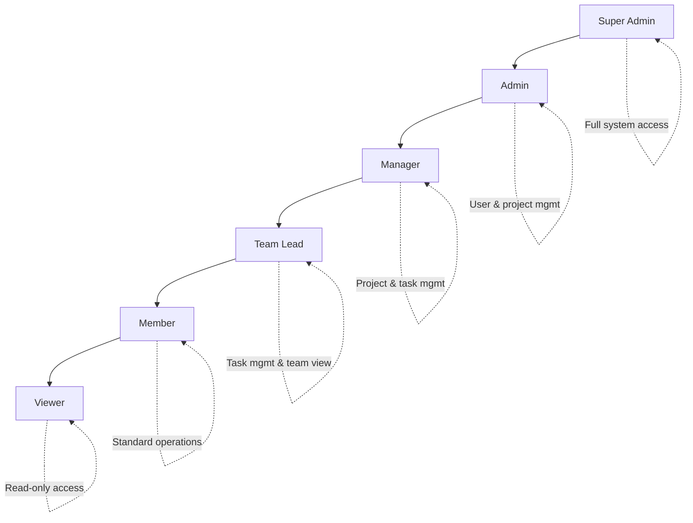

### Super Admin

| Attribute | Detail |
|---|---|
| **Responsibilities** | Full system administration, user/role/permission management, system configuration, security oversight |
| **Can Create** | Users, roles, projects, tasks, teams, announcements, feature flags, system settings |
| **Can Delete** | Users, roles (non-system), projects, tasks, feature flags |
| **Can Modify** | All user accounts, all roles, all permissions, all system settings |
| **Can View** | Everything — all data, all logs, all analytics, all audit entries |
| **Special Powers** | Assign any role to any user, force password resets, access system health, manage API keys |
| **Restrictions** | Cannot delete their own account (implicit) |
| **Bootstrap** | Created automatically on first seed: `admin@pulse.com` with forced password reset |

### Admin

| Attribute | Detail |
|---|---|
| **Responsibilities** | Day-to-day user management, project oversight, team administration |
| **Can Create** | Users, projects, tasks |
| **Can Edit** | Users, projects, tasks, workspaces |
| **Can Delete** | Projects, tasks |
| **Can View** | All users, all projects, all tasks, analytics, audit logs, login history |
| **Special Powers** | Suspend/activate users, assign roles (except Super Admin), manage team assignments |
| **Restrictions** | Cannot delete users, cannot create/edit/delete roles, cannot access system settings |

### Manager

| Attribute | Detail |
|---|---|
| **Responsibilities** | Project delivery, task management, team coordination |
| **Can Create** | Projects, tasks |
| **Can Edit** | Projects, tasks |
| **Can Archive** | Projects |
| **Can View** | All projects, all tasks, team members, analytics (own scope), activity |
| **Restrictions** | Cannot manage users, roles, or system settings; cannot delete projects |

### Team Lead

| Attribute | Detail |
|---|---|
| **Responsibilities** | Task delegation, team progress tracking, code review coordination |
| **Can Create** | Tasks |
| **Can Edit** | Tasks (assign, status, priority) |
| **Can View** | Team members, assigned projects, task details, activity |
| **Special Powers** | Pin/delete chat messages in their team, designate team members |
| **Restrictions** | Cannot create projects, cannot manage users or system settings |

### Member

| Attribute | Detail |
|---|---|
| **Responsibilities** | Complete assigned tasks, participate in team chat, update task status |
| **Can Create** | Tasks (self-assigned) |
| **Can Edit** | Own tasks (status updates) |
| **Can View** | Assigned projects, team chat, own activity |
| **Special Powers** | Edit/delete own chat messages (within 15-min window) |
| **Restrictions** | Cannot create projects, cannot manage users, cannot access admin panel |

### Viewer

| Attribute | Detail |
|---|---|
| **Responsibilities** | Monitor progress, review dashboards, read-only access |
| **Can View** | Projects, tasks, team info, analytics (read-only), activity |
| **Restrictions** | Cannot create, edit, or delete anything; cannot access admin panel; can view analytics |

### Permission Matrix (40 Permissions)

| Module | Permission | SA | Admin | Manager | Team Lead | Member | Viewer |
|---|---|:---:|:---:|:---:|:---:|:---:|:---:|
| **Users** | view | ✓ | ✓ | | | | |
| | create | ✓ | ✓ | | | | |
| | edit | ✓ | ✓ | | | | |
| | delete | ✓ | | | | | |
| | suspend | ✓ | ✓ | | | | |
| | activate | ✓ | ✓ | | | | |
| | reset_password | ✓ | | | | | |
| | change_role | ✓ | | | | | |
| **Roles** | view | ✓ | ✓ | | | | |
| | create | ✓ | | | | | |
| | edit | ✓ | | | | | |
| | delete | ✓ | | | | | |
| | assign | ✓ | | | | | |
| **Projects** | view | ✓ | ✓ | ✓ | ✓ | ✓ | ✓ |
| | create | ✓ | ✓ | ✓ | | | |
| | edit | ✓ | ✓ | ✓ | | | |
| | delete | ✓ | | | | | |
| | archive | ✓ | ✓ | ✓ | | | |
| | restore | ✓ | ✓ | | | | |
| **Tasks** | view | ✓ | ✓ | ✓ | ✓ | ✓ | ✓ |
| | create | ✓ | ✓ | ✓ | ✓ | ✓ | |
| | edit | ✓ | ✓ | ✓ | ✓ | ✓ | |
| | delete | ✓ | ✓ | ✓ | ✓ | | |
| | assign | ✓ | ✓ | ✓ | ✓ | | |
| **Workspaces** | view | ✓ | ✓ | ✓ | ✓ | ✓ | ✓ |
| | edit | ✓ | ✓ | | | | |
| **Teams** | view | ✓ | ✓ | ✓ | ✓ | ✓ | ✓ |
| | manage | ✓ | ✓ | | | | |
| **Analytics** | view | ✓ | ✓ | ✓ | ✓ | | ✓ |
| | export | ✓ | ✓ | | | | |
| **Audit** | view | ✓ | ✓ | | | | |
| **System** | settings | ✓ | | | | | |
| | health | ✓ | | | | | |
| | feature_flags | ✓ | | | | | |
| | api_keys | ✓ | | | | | |
| | announcements | ✓ | | | | | |
| **Activity** | view | ✓ | ✓ | ✓ | ✓ | | ✓ |
| **Notifications** | manage | ✓ | ✓ | | | | |

---

## Core Features

### 1. Authentication

**Purpose:** Secure user identity verification and session management.

**User Flow:**
1. User navigates to `/login`
2. Enters email and password
3. System verifies credentials against bcrypt-hashed password
4. JWT token issued (7-day expiry)
5. Token stored in `sessionStorage`
6. User redirected to `/dashboard`

**Business Rules:**
- Passwords hashed with bcrypt (12 salt rounds)
- Account locked after 5 failed login attempts (30-minute window)
- All login attempts logged with IP, user agent, device type
- Forced password reset on first login for bootstrap admin
- Registration creates a new workspace automatically

**Permissions:** Public (login/register), Authenticated (me, change-password)

**Success Criteria:**
- Login completes in < 2 seconds
- Invalid credentials return clear error messages without revealing whether email exists
- Locked accounts display lockout message with time remaining

---

### 2. Authorization (RBAC)

**Purpose:** Granular access control ensuring users see and do only what their role permits.

**User Flow:**
1. JWT verified on every protected request
2. User permissions fetched (cached 5 minutes)
3. `hasPermission(userId, "resource:action")` checked
4. If authorized → proceed; if not → 403 response

**Business Rules:**
- Every admin API endpoint checks permissions before execution
- System roles (Super Admin, Admin, Manager, Team Lead, Member, Viewer) cannot be deleted
- Custom roles can be created by Super Admin only
- Permission changes take effect immediately (cache TTL is 5 minutes)

**Permissions:** Varies by endpoint (see Permission Matrix above)

**Success Criteria:**
- Unauthorized access attempts return 403 within 100ms
- Permission cache reduces database queries by > 80%
- Role assignment changes propagate within 5 minutes

---

### 3. Dashboard

**Purpose:** Provide users with an at-a-glance view of their work and team performance.

**User Flow:**
1. User logs in → redirected to `/dashboard`
2. Dashboard loads stat cards (projects, tasks, completion rate, team size)
3. Activity feed displays recent actions
4. Performance charts show weekly trends
5. Top performers leaderboard highlights contributors

**Business Rules:**
- Dashboard data fetched in parallel for performance
- Stat cards show real-time counts from database
- Activity feed limited to 20 most recent entries
- Completion rate calculated across all assigned tasks

**Permissions:** All authenticated users (content scoped by role)

**Success Criteria:**
- Dashboard loads in < 1.5 seconds
- All stat cards display accurate, up-to-date data
- Activity feed updates without page refresh

---

### 4. User Management

**Purpose:** Admin-level CRUD operations for user accounts.

**User Flow:**
1. Admin navigates to `/admin/users`
2. Views paginated user list with search and filters
3. Can create, edit, suspend, activate, or delete users
4. Can reset passwords and change roles
5. Each action generates an audit log entry

**Business Rules:**
- Admins cannot delete Super Admin accounts
- Suspending a user prevents login but preserves data
- Password reset generates a temporary password or forces reset on next login
- User status: `active`, `suspended`, `pending`
- Registration creates users with default `member` role

**Permissions:** `users:view`, `users:create`, `users:edit`, `users:delete`, `users:suspend`, `users:activate`, `users:reset_password`, `users:change_role`

**Success Criteria:**
- User list paginated with 20 users per page
- Search filters by name, email, status, and role
- All mutations logged to audit trail

---

### 5. Team Management

**Purpose:** Organize users into teams within workspaces for collaboration and assignment.

**User Flow:**
1. Admin creates a team within a workspace
2. Adds members and assigns a team lead
3. Team can be assigned projects and tasks
4. Team members inherit assignments automatically
5. New members added to team also inherit active assignments

**Business Rules:**
- Teams belong to workspaces
- A user can be a member of multiple teams
- Team roles: `member` (default) and `lead`
- Team assignments cascade: when a team is assigned a project/task, all current members inherit it
- New members added to a team inherit existing active assignments
- Chat rooms are per-team with access control

**Permissions:** `teams:view`, `teams:manage`

**Success Criteria:**
- Team creation completes in < 1 second
- Assignment inheritance works correctly for new members
- Team chat is accessible only to team members (admins bypass)

---

### 6. Project Management

**Purpose:** Create, organize, and track projects across workspaces.

**User Flow:**
1. User creates a project with name, description, and color
2. Project appears in grid view with progress indicator
3. Tasks are created within the project
4. Kanban board shows task status distribution
5. Projects can be archived and restored

**Business Rules:**
- Projects belong to a workspace and have an owner
- Status: `active`, `archived`, `deleted`
- Color coding for visual identification (default: `#6366f1`)
- Project members can be managed per-project
- Archiving hides project from default views but preserves data
- Task count and completion percentage calculated automatically

**Permissions:** `projects:view`, `projects:create`, `projects:edit`, `projects:delete`, `projects:archive`, `projects:restore`

**Success Criteria:**
- Project grid loads in < 1 second
- Kanban board renders all task columns accurately
- Archive/restore operations complete in < 500ms

---

### 7. Task Management

**Purpose:** Create, assign, track, and manage tasks within projects.

**User Flow:**
1. User creates a task with title, description, status, priority, and project
2. Task appears in project's task list and Kanban board
3. Status transitions: To Do → In Progress → In Review → Done
4. Tasks can be assigned to team members
5. Due dates, priority levels, and comments track task lifecycle

**Business Rules:**
- Four statuses: `todo`, `in_progress`, `in_review`, `done`
- Four priorities: `low`, `medium`, `high`, `urgent`
- Position field enables Kanban column ordering
- Due dates displayed but not enforced (no auto-archiving)
- Bulk operations available for admin task management
- Task comments support threaded discussion
- Activity log tracks all task state changes

**Permissions:** `tasks:view`, `tasks:create`, `tasks:edit`, `tasks:delete`, `tasks:assign`

**Success Criteria:**
- Task creation completes in < 500ms
- Kanban board renders without lag for projects with 100+ tasks
- Status transitions update in real-time for team members

---

### 8. Team Chat

**Purpose:** Real-time messaging within teams powered by Socket.IO.

**User Flow:**
1. User navigates to `/dashboard/team/chat`
2. Joins team chat room via Socket.IO
3. Sends messages with optional file attachments
4. Sees typing indicators and online presence
5. Can reply, edit (15-min window), delete, and pin messages

**Business Rules:**
- Messages stored in database with real-time broadcast via Socket.IO
- Edit window: 15 minutes from send time
- Delete permissions: author, admin, or team lead
- Pin permissions: admin or team lead
- Threaded replies supported via `replyToId`
- Online presence tracked per team room
- Typing indicators broadcast with 2-second timeout
- Read receipts tracked per message per user
- Chat RBAC: team membership required (admins bypass)

**Permissions:** Team membership required (admin/Super Admin bypass)

**Success Criteria:**
- Message delivery in < 1 second
- Typing indicators appear within 500ms
- Online presence updates in real-time
- Read receipts accurately reflect message visibility

---

### 9. Media Sharing

**Purpose:** File and image uploads within team chat.

**User Flow:**
1. User clicks attachment button or drags file into chat input
2. File is validated (type, size) and uploaded to `/api/chat/upload`
3. Upload progress displayed in chat input area
4. On send, attachments linked to message
5. Recipients see inline previews (images) or file cards (documents)

**Business Rules:**
- Supported types: images (JPEG, PNG, GIF, WEBP), videos (MP4, WebM), audio (MP3, WAV, OGG), documents (PDF, DOC, DOCX, XLS, XLSX, TXT, ZIP)
- Max file size: 5MB per file
- Images display inline with lightbox preview
- Videos show with play button overlay and duration
- Audio files show with native player
- Documents show with file type icon and download link
- Drag-and-drop and clipboard paste supported
- Files stored in `public/chat-files/{teamId}/`

**Permissions:** Team membership required

**Success Criteria:**
- Upload completes in < 5 seconds for files under 1MB
- Image previews render without layout shift
- File type icons correctly identify document types

---

### 10. Notifications

**Purpose:** Alert users to important events and actions.

**User Flow:**
1. System generates notifications for relevant events
2. User sees unread count on bell icon in header
3. Clicking bell opens notification dropdown
4. User can mark all as read or clear all
5. Notifications grouped by type (announcements, system)

**Business Rules:**
- Notification types: `info`, `warning`, `error`, `success`
- Unread count displayed as badge on bell icon
- Announcements shown in separate section within notification panel
- Mark all read updates all unread notifications
- Clear all deletes all notifications for the user
- Notifications support deep links via `link` field

**Permissions:** All authenticated users for viewing; `notifications:manage` for admin

**Success Criteria:**
- Notification panel loads in < 500ms
- Unread count updates in real-time
- Mark all read completes without page refresh

---

### 11. Announcements

**Purpose:** System-wide or targeted broadcasts from administrators.

**User Flow:**
1. Admin creates announcement with title, message, type, and target audience
2. Announcement appears in user notification panels
3. Unread count badge updates on sidebar and header
4. Users can mark individual announcements as read
5. Announcements can have expiration dates

**Business Rules:**
- Types: `info`, `warning`, `critical`
- Target audiences: `everyone`, `teams`, `roles`, `users`
- Target IDs stored as JSON array
- Expiration dates auto-deactivate announcements
- Read tracking per user via `AnnouncementRead` model
- Real-time deletion broadcast via Socket.IO (`announcement:deleted`)
- Banner component displays active announcements

**Permissions:** `system:announcements` for create/delete; all users can view and mark read

**Success Criteria:**
- Announcements appear in user panels within 5 seconds of creation
- Targeted announcements only reach intended recipients
- Expired announcements are automatically hidden

---

### 12. Activity Feed

**Purpose:** Track and display user actions across the platform.

**User Flow:**
1. System logs activities for key actions (task creation, status changes, etc.)
2. Activity feed displayed on dashboard and admin panel
3. Users can filter by type, user, or date range
4. Each activity shows user, action, target, and timestamp

**Business Rules:**
- Activities linked to users and optionally to tasks
- Activity types: task created, task updated, task completed, user joined, etc.
- Feed limited to 20 entries per page
- Relative timestamps: `just now`, `5m ago`, `2h ago`, `3d ago`
- Admin activity feed shows all users; user feed shows own + team

**Permissions:** `activity:view` for admin; users see own + team activity

**Success Criteria:**
- Activities logged within 100ms of the triggering action
- Feed loads in < 1 second
- Filtering returns results in < 500ms

---

### 13. Audit Logs

**Purpose:** Comprehensive trail of all admin actions for compliance and investigation.

**User Flow:**
1. Admin performs any mutation (create, update, delete)
2. System captures: admin ID, action, resource, before state, after state, IP, user agent, device
3. Audit log entry stored in database
4. Admin can view logs at `/admin/audit` with filtering

**Business Rules:**
- Every admin mutation generates an audit entry
- Before/after snapshots stored as JSON strings
- IP address and user agent captured from request headers
- Device type parsed from user agent (Desktop/Mobile/Tablet)
- Indexed on `adminId`, `action`, `resource`, `createdAt` for fast queries
- Audit logs are append-only (no editing or deletion)

**Permissions:** `audit:view` (Super Admin and Admin only)

**Success Criteria:**
- Audit entry created within 200ms of action
- Before/after snapshots accurately reflect state changes
- Log query returns results in < 1 second for 10,000+ entries

---

### 14. Feature Flags

**Purpose:** Dynamic enable/disable of system features without code deployment.

**User Flow:**
1. Admin navigates to `/admin/feature-flags`
2. Views list of feature flags with enabled/disabled status
3. Can create, toggle, or delete flags
4. Application checks flag state before enabling features

**Business Rules:**
- Flags have: name (unique), description, enabled (boolean)
- Default state: disabled
- Flag state checked at runtime (no caching for immediate effect)
- Creation and deletion logged to audit trail

**Permissions:** `system:feature_flags` (Super Admin only)

**Success Criteria:**
- Flag toggle takes effect immediately
- Flag list loads in < 500ms
- All flag changes audited

---

### 15. User Profiles & Avatar System

**Purpose:** User identity management with profile customization.

**User Flow:**
1. User navigates to `/dashboard/settings`
2. Views profile with avatar, name, email
3. Can upload/change avatar with crop and zoom
4. Can delete avatar (reverts to initials/crown)
5. Avatar displayed across the application

**Business Rules:**
- Avatar upload: JPEG, PNG, WEBP, max 5MB
- Server-side crop to 400x400px
- Avatar metadata tracked: file name, MIME type, size, upload time
- Cache-busting on avatar URL changes (`?v=...`)
- Fallback chain: uploaded image → crown SVG (admin/SA) → initials
- Avatar cache headers: `Cache-Control: public, max-age=0, must-revalidate`

**Permissions:** All authenticated users for own profile; admin for any user

**Success Criteria:**
- Avatar upload completes in < 3 seconds
- Avatar changes propagate across UI within 1 second
- Fallback rendering works correctly for all role combinations

---

### 16. Settings

**Purpose:** User and system configuration management.

**User Flow:**
1. User navigates to `/dashboard/settings`
2. Updates profile fields (name, email)
3. Changes theme (Light/Dark/System)
4. Changes password
5. Admin can manage system settings at `/admin/settings`

**Business Rules:**
- Theme stored in Zustand store with persistence
- System settings categorized: `general`, `auth`, `email`, `storage`, `security`
- Password change requires current password verification
- Settings changes take effect immediately

**Permissions:** Users manage own settings; `system:settings` for admin system settings

**Success Criteria:**
- Theme switch completes without flash of unstyled content
- Password change validates current password before allowing change
- System settings persist across server restarts

---

### 17. Search & Filtering

**Purpose:** Find users, projects, tasks, and other entities quickly.

**User Flow:**
1. User enters search query in search input
2. Results filtered in real-time or on submit
3. Filters narrow results by status, priority, role, etc.
4. Pagination handles large result sets

**Business Rules:**
- Search is server-side with database queries
- Filtering supports multiple simultaneous criteria
- Pagination: 20 items per page (configurable)
- Search by name, email, title, description
- Filter by status, priority, role, assignment

**Permissions:** Inherits permissions of the page being searched

**Success Criteria:**
- Search results return in < 500ms
- Filters apply without page reload
- Empty states displayed when no results match

---

### 18. File Upload

**Purpose:** Handle file uploads for avatars, chat attachments, and documents.

**User Flow:**
1. User selects or drags file
2. Client validates file type and size
3. File uploaded via multipart form data
4. Server validates, processes, and stores file
5. File URL returned for display/linking

**Business Rules:**
- Avatar uploads: max 5MB, JPEG/PNG/WEBP only
- Chat uploads: max 5MB per file, broader type support
- Files stored in `public/avatars/` and `public/chat-files/{teamId}/`
- File names randomized to prevent collisions
- Metadata tracked in database for avatars
- Chat attachments linked to messages via `ChatAttachment` model

**Permissions:** Authenticated users for own avatar; team members for chat

**Success Criteria:**
- Upload completes in < 5 seconds for files under 1MB
- Invalid files rejected with clear error messages
- Uploaded files accessible immediately via URL

---

### 19. Reporting & Analytics

**Purpose:** Provide data-driven insights into team and system performance.

**User Flow:**
1. Admin navigates to `/admin/analytics`
2. Views system-wide metrics: total users, projects, tasks, completion rates
3. Charts display trends over time
4. User dashboard shows team-specific metrics

**Business Rules:**
- Analytics calculated from database aggregates
- Charts use Recharts library with responsive containers
- Data refreshed on page load (no auto-refresh)
- Export capability for admin analytics
- User dashboard shows: project count, task count, completion rate, team size

**Permissions:** `analytics:view` for admin; users see own/team metrics

**Success Criteria:**
- Analytics page loads in < 2 seconds
- Charts render correctly with accurate data
- Export generates valid data format

---

### 20. Real-Time Communication

**Purpose:** Power team chat, presence, typing indicators, and notifications via WebSocket.

**User Flow:**
1. Client connects to Socket.IO server on page load
2. Authenticates via JWT token in handshake
3. Joins team chat rooms on demand
4. Receives real-time messages, typing indicators, presence updates
5. Broadcasts own typing status and message reads

**Business Rules:**
- Socket.IO with WebSocket transport (polling fallback)
- JWT verification on handshake
- Room-based architecture: `team:{teamId}`
- Events: `chat:join`, `chat:leave`, `chat:message`, `chat:edit`, `chat:delete`, `chat:pin`, `chat:typing`, `chat:read`, `chat:online`, `announcement:read`
- Online presence tracked in-memory per team
- Typing timeout: 2 seconds of inactivity
- CORS configured via `NEXT_PUBLIC_APP_URL`

**Permissions:** Team membership required for chat events

**Success Criteria:**
- Connection established in < 2 seconds
- Message round-trip in < 1 second
- Presence updates reflected within 500ms
- Graceful reconnection on network interruption

---

## Functional Requirements

### Authentication

| ID | Requirement | Input | Output | Validation | Error Handling | Edge Cases |
|---|---|---|---|---|---|---|
| FR-AUTH-01 | User login | `{ email, password }` | `{ user, token }` | Email format, password min 8 chars | 401 for invalid credentials, 423 for locked account | Account lockout after 5 attempts |
| FR-AUTH-02 | User registration | `{ name, email, password }` | `{ user, token, workspace }` | Name 2+ chars, valid email, password strength | 409 for duplicate email | First user becomes workspace owner |
| FR-AUTH-03 | Get current user | Bearer token | `{ user }` | Valid JWT | 401 for expired/invalid token | Token refresh not implemented |
| FR-AUTH-04 | Change password | `{ currentPassword, newPassword }` | Success/error | Current password verified, new password strength | 400 for wrong current password | Force reset users must change password |

### User Management

| ID | Requirement | Input | Output | Validation | Error Handling | Edge Cases |
|---|---|---|---|---|---|---|
| FR-USER-01 | List users | Query params | `{ users, total, page, totalPages }` | Page/limit positive integers | 403 for insufficient permissions | Empty results return empty array |
| FR-USER-02 | Create user | `{ name, email, password, role }` | Created user | All fields required, email unique | 409 for duplicate email | Default role is `member` |
| FR-USER-03 | Update user | `{ name, email, status }` | Updated user | At least one field provided | 404 if user not found | Cannot deactivate self |
| FR-USER-04 | Delete user | User ID | Success/error | User exists, not self | 403 for Super Admin protection | Cascade deletes related data |
| FR-USER-05 | Suspend user | `{ suspend: boolean }` | Updated user | Boolean required | 404 if user not found | Suspended users cannot login |
| FR-USER-06 | Reset password | `{ newPassword, forceReset }` | Success/error | Password strength validated | 404 if user not found | Optional force reset flag |
| FR-USER-07 | Change role | `{ roleId }` | Updated user | Role exists, not self-assign Super Admin | 403 for role assignment restriction | Only Super Admin can assign Super Admin |

### Project Management

| ID | Requirement | Input | Output | Validation | Error Handling | Edge Cases |
|---|---|---|---|---|---|---|
| FR-PRJ-01 | List projects | Query params | `{ projects, total }` | Status filter valid | 403 for insufficient permissions | Archived projects optional |
| FR-PRJ-02 | Create project | `{ name, description, color }` | Created project | Name required, color hex valid | 400 for missing name | Default color `#6366f1` |
| FR-PRJ-03 | Update project | `{ name, description, color, status }` | Updated project | At least one field | 404 if not found | Status transitions validated |
| FR-PRJ-04 | Delete project | Project ID | Success/error | Project exists | 403 for non-owner | Cascade deletes tasks |

### Task Management

| ID | Requirement | Input | Output | Validation | Error Handling | Edge Cases |
|---|---|---|---|---|---|---|
| FR-TASK-01 | List tasks | Query params | `{ tasks, total }` | Status/priority filters | 403 for insufficient permissions | Empty project returns empty |
| FR-TASK-02 | Create task | `{ title, description, status, priority, projectId }` | Created task | Title required, project exists | 404 for invalid project | Default status `todo`, priority `medium` |
| FR-TASK-03 | Update task | `{ title, status, priority, assigneeId }` | Updated task | At least one field | 404 if not found | Position updates for Kanban |
| FR-TASK-04 | Delete task | Task ID | Success/error | Task exists | 403 for insufficient permissions | Cascade deletes comments |
| FR-TASK-05 | Bulk delete | `{ taskIds: string[] }` | Success/error | All IDs valid | 400 for empty array | Partial failure handling |

### Team Chat

| ID | Requirement | Input | Output | Validation | Error Handling | Edge Cases |
|---|---|---|---|---|---|---|
| FR-CHAT-01 | Join room | `{ teamId }` | Online users | Team membership verified | `chat:error` for access denied | Admin bypass for all teams |
| FR-CHAT-02 | Send message | `{ teamId, content, replyToId?, attachmentIds? }` | Message object | Content or attachments required | `chat:error` for failure | Empty content with attachments allowed |
| FR-CHAT-03 | Edit message | `{ teamId, messageId, content }` | Updated message | Author only, 15-min window | `chat:error` for unauthorized | Edit window expired |
| FR-CHAT-04 | Delete message | `{ teamId, messageId }` | Delete confirmation | Author, admin, or team lead | `chat:error` for unauthorized | Read receipts deleted with message |
| FR-CHAT-05 | Pin message | `{ teamId, messageId }` | Updated message | Admin or team lead | `chat:error` for unauthorized | Toggle pin/unpin |
| FR-CHAT-06 | Typing indicator | `{ teamId, isTyping }` | Broadcast to room | Boolean required | None | 2-second auto-timeout |
| FR-CHAT-07 | Read receipt | `{ teamId, messageIds }` | Read receipt broadcast | Message IDs valid | None | Deduplication via unique constraint |

### File Upload

| ID | Requirement | Input | Output | Validation | Error Handling | Edge Cases |
|---|---|---|---|---|---|---|
| FR-FILE-01 | Avatar upload | Multipart file | `{ url, metadata }` | Type: JPEG/PNG/WEBP, size < 5MB | 400 for invalid type/size | Old avatar replaced |
| FR-FILE-02 | Chat upload | Multipart file, teamId | Attachment object | Type whitelist, size < 5MB | 400 for invalid, 403 for no team access | Server-side crop for images |

---

## Non-Functional Requirements

### Performance

| Metric | Requirement | Measurement |
|---|---|---|
| Page load (initial) | < 3 seconds on 3G | Lighthouse score |
| API response time | < 500ms (p95) | Server logs |
| Chat message delivery | < 1 second end-to-end | Socket.IO round-trip |
| Dashboard render | < 1.5 seconds | Time to interactive |
| Database query | < 100ms (p95) | Prisma query logs |
| File upload (1MB) | < 3 seconds | Upload endpoint timing |

### Scalability

| Dimension | Current | Target |
|---|---|---|
| Concurrent users | 50 | 200 |
| Messages per day | 1,000 | 10,000 |
| Projects per workspace | 50 | 200 |
| Tasks per project | 200 | 500 |
| File storage | 1GB | 10GB |
| Audit log entries | 10,000 | 100,000 |

### Reliability

| Requirement | Description |
|---|---|
| Data integrity | SQLite ACID transactions for all mutations |
| Graceful degradation | Socket.IO falls back to polling if WebSocket fails |
| Error recovery | Client-side error boundaries prevent full-page crashes |
| State persistence | Auth token in sessionStorage, theme in localStorage |

### Availability

| Requirement | Description |
|---|---|
| Uptime target | 99.9% (excluding maintenance) |
| Health check | `/api/admin/health` endpoint returns DB stats |
| Process management | Single Node.js process with custom server |
| Restart recovery | SQLite persists across restarts, no data loss |

### Security

| Requirement | Description |
|---|---|
| Authentication | JWT with 7-day expiry, bcrypt password hashing |
| Authorization | RBAC with 40 permissions, checked on every admin endpoint |
| Input validation | Zod schemas on all API inputs |
| Rate limiting | Database-backed per-key rate limiting |
| Account lockout | 5 failed attempts → 30-minute lockout |
| Secure headers | `poweredByHeader: false`, strict CORS |
| Environment | `.env` excluded from git and Docker |

### Accessibility

| Requirement | Description |
|---|---|
| Keyboard navigation | All interactive elements focusable and operable |
| Focus indicators | Visible focus rings on all interactive elements |
| Screen reader | Semantic HTML, ARIA labels, alt text |
| Color contrast | WCAG AA minimum for all text |
| Reduced motion | CSS transitions under 300ms |

### Maintainability

| Requirement | Description |
|---|---|
| TypeScript | 100% TypeScript, strict mode |
| Component architecture | Reusable UI primitives in `src/components/ui/` |
| State management | Zustand stores for auth, sidebar, theme |
| Code style | ESLint with `eslint-config-next` |
| Documentation | README.md, DESIGN.md, PRD.md, file.md |

### Observability

| Requirement | Description |
|---|---|
| Server logging | Request/response logging in development |
| Error tracking | Console error logging with stack traces |
| Socket.IO events | Connection, disconnection, error logging |
| Database queries | Prisma query logging in development |

### Logging

| Event | Log Level | Details |
|---|---|---|
| Server start | INFO | Port, environment |
| Authentication | INFO | Login success/failure, user ID |
| Admin actions | INFO | Action, resource, admin ID (also audit logged) |
| Socket.IO errors | ERROR | Event, error message, user ID |
| Database errors | ERROR | Query, error message |
| File upload | INFO | File name, size, user ID |

### Backup & Recovery

| Requirement | Description |
|---|---|
| Database backup | Copy `prisma/dev.db` file |
| File backup | Copy `public/avatars/` and `public/chat-files/` |
| Recovery | Restore files, run `npx prisma db push` if schema changed |
| Seed recovery | `npm run db:reset` recreates schema and seeds data |

---

## User Flows

### Login Flow

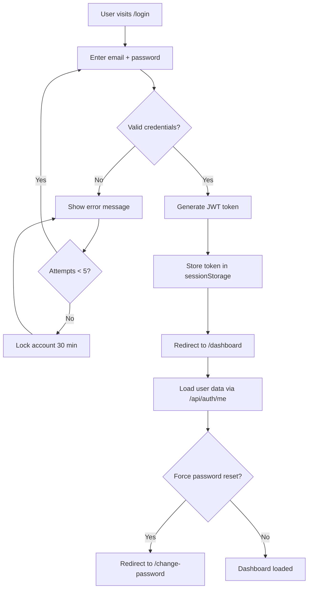

### First Login Flow

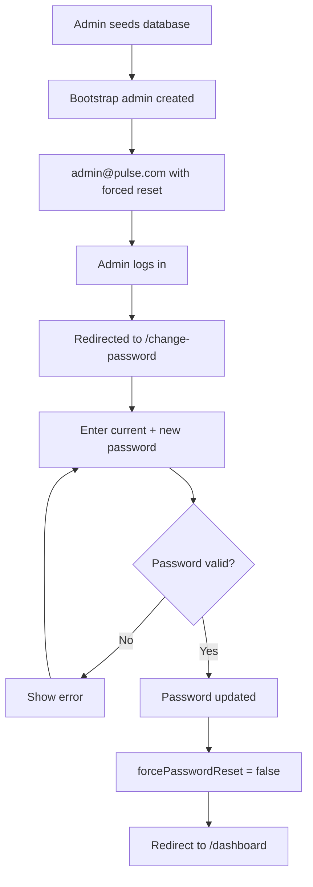

### Team Creation Flow

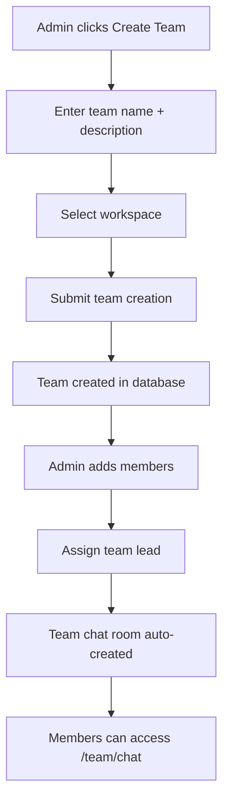

### Project Creation Flow

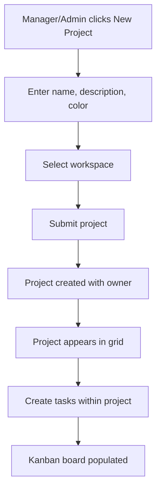

### Task Assignment Flow

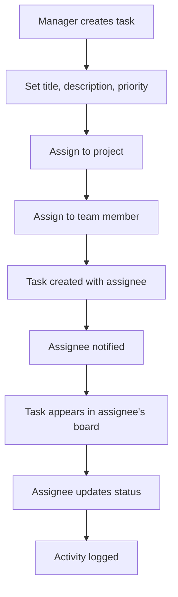

### Team Chat Flow

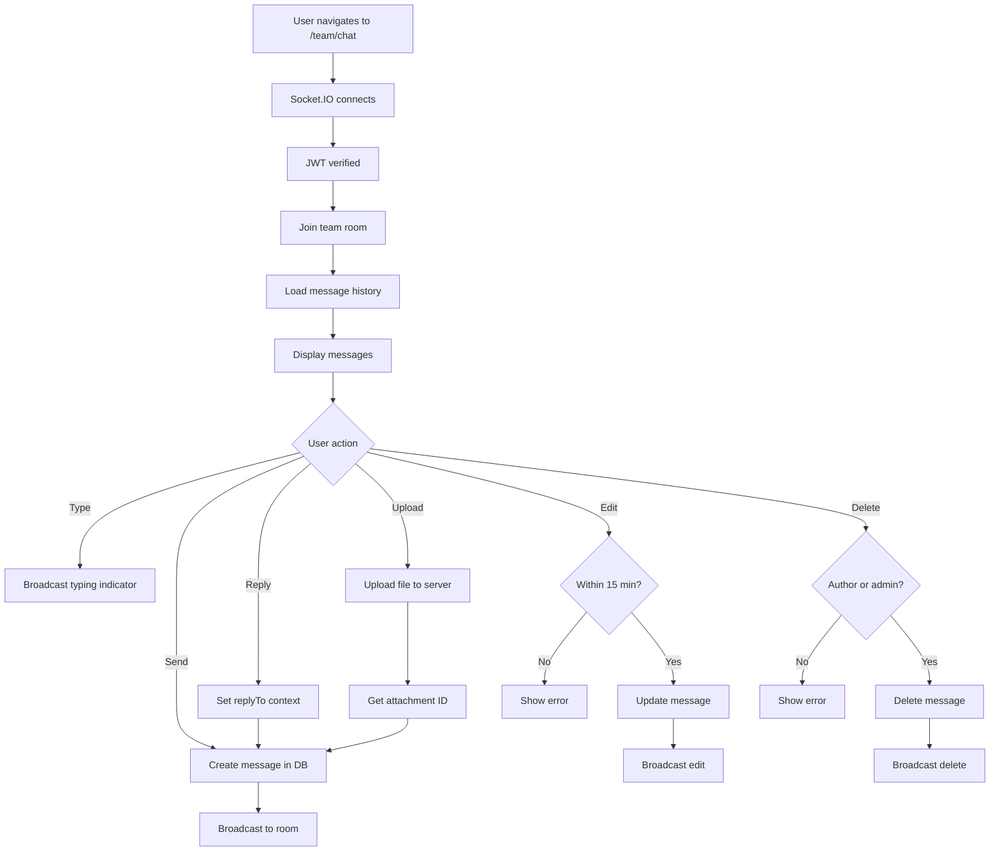

### Announcement Publishing Flow

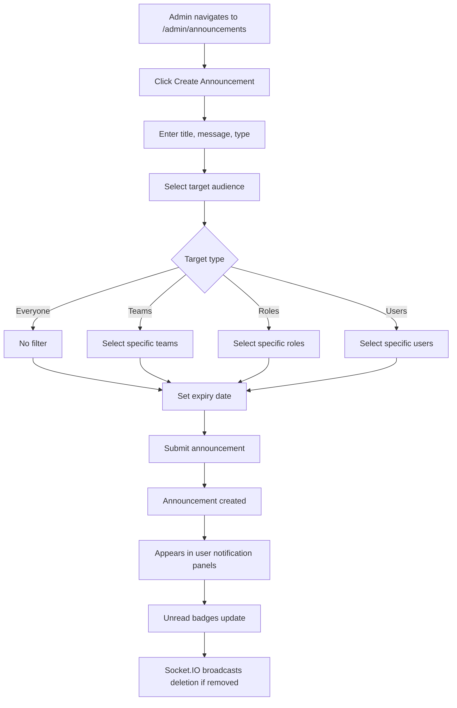

### Media Upload Flow

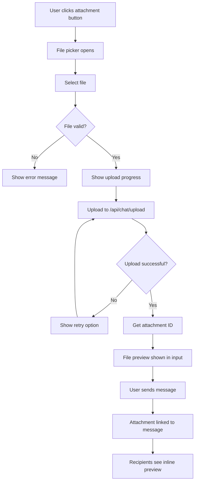

### Audit Logging Flow

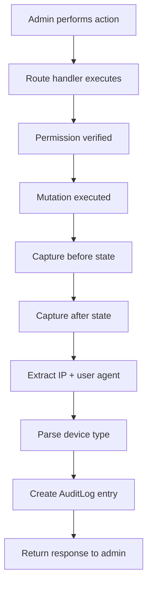

---

## Database Overview

### Entity Relationship Summary

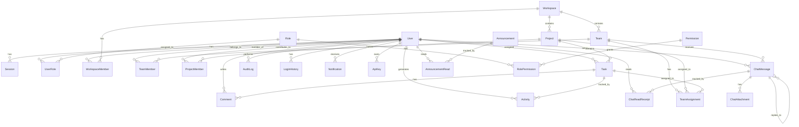

### Main Entities

| Entity | Description | Key Fields |
|---|---|---|
| `User` | User accounts with auth, avatar, status | email, password, role, status, avatarUrl, forcePasswordReset |
| `Session` | Active user sessions | token, userId, expiresAt, ipAddress |
| `Role` | RBAC roles (system + custom) | name, isSystem, isDefault |
| `Permission` | Granular permissions (40 total) | name, module, action |
| `Workspace` | Top-level organizational unit | name, slug, status |
| `Team` | Groups within workspaces | name, description, workspaceId |
| `Project` | Work items with tasks | name, description, color, status, ownerId |
| `Task` | Individual work items | title, description, status, priority, position, dueDate |
| `ChatMessage` | Real-time chat messages | content, type, teamId, userId, replyToId, pinned |
| `ChatAttachment` | File attachments for messages | fileName, mimeType, fileSize, fileType, url |
| `AuditLog` | Admin action audit trail | adminId, action, resource, before, after, ipAddress |
| `Announcement` | System broadcasts | title, message, type, targetType, targetIds, expiresAt |

### Data Ownership

| Entity | Owner | Scope |
|---|---|---|
| User | Self / Admin | Global |
| Workspace | Creator | Per-workspace |
| Team | Workspace | Per-workspace |
| Project | Owner | Per-workspace |
| Task | Assigner / Assignee | Per-project |
| ChatMessage | Author | Per-team |
| AuditLog | System (append-only) | Global |
| Notification | Recipient | Per-user |

### File Storage

| Type | Location | Naming |
|---|---|---|
| Avatars | `public/avatars/` | `{userId}-{timestamp}.{ext}` |
| Chat files | `public/chat-files/{teamId}/` | `{messageId}-{timestamp}-{hash}.{ext}` |

---

## API Overview

### Authentication

All protected endpoints require:
```
Authorization: Bearer <jwt_token>
```

### REST Endpoints

| Module | Base Path | Methods | Auth |
|---|---|---|---|
| **Auth** | `/api/auth` | POST login, POST register, GET me, POST change-password | Public / Bearer |
| **Admin Users** | `/api/admin/users` | GET, POST, GET/:id, PATCH/:id, DELETE/:id, PATCH/:id/suspend, POST/:id/reset-password, PATCH/:id/role | Bearer + RBAC |
| **Admin Roles** | `/api/admin/roles` | GET, POST, PATCH/:id, DELETE/:id, PUT/:id/permissions | Bearer + RBAC |
| **Admin Permissions** | `/api/admin/permissions` | GET | Bearer + RBAC |
| **Admin Projects** | `/api/admin/projects` | GET, PATCH/:id, DELETE/:id | Bearer + RBAC |
| **Admin Tasks** | `/api/admin/tasks` | GET, PATCH/:id, DELETE/:id | Bearer + RBAC |
| **Admin Teams** | `/api/admin/teams` | GET, GET/:id, GET/:id/chat, GET/:id/members | Bearer + RBAC |
| **Admin Analytics** | `/api/admin/analytics` | GET | Bearer + RBAC |
| **Admin Activity** | `/api/admin/activity` | GET | Bearer + RBAC |
| **Admin Audit** | `/api/admin/audit` | GET | Bearer + RBAC |
| **Admin Workspaces** | `/api/admin/workspaces` | GET | Bearer + RBAC |
| **Admin Health** | `/api/admin/health` | GET | Bearer + RBAC |
| **Admin Settings** | `/api/admin/settings` | GET, PATCH/:id | Bearer + RBAC |
| **Admin Feature Flags** | `/api/admin/feature-flags` | GET, POST, PATCH/:id, DELETE/:id | Bearer + RBAC |
| **Admin Login History** | `/api/admin/login-history` | GET | Bearer + RBAC |
| **Admin Announcements** | `/api/admin/announcements` | GET, POST, DELETE/:id | Bearer + RBAC |
| **Admin Assignments** | `/api/admin/assignments` | GET | Bearer + RBAC |
| **Projects** | `/api/projects` | GET, GET/:id | Bearer |
| **Tasks** | `/api/tasks` | GET, GET/:id | Bearer |
| **Teams** | `/api/teams` | GET | Bearer |
| **Activities** | `/api/activities` | GET | Bearer |
| **Notifications** | `/api/notifications` | GET, PATCH, DELETE | Bearer |
| **Announcements** | `/api/announcements` | GET, POST/:id/read, POST/read-all | Bearer |
| **Chat Upload** | `/api/chat/upload` | POST | Bearer |
| **User Avatar** | `/api/user/avatar` | POST, DELETE | Bearer |

### WebSocket Events

| Event | Direction | Payload | Auth |
|---|---|---|---|
| `chat:join` | Client→Server | `{ teamId }` | JWT on handshake |
| `chat:leave` | Client→Server | `{ teamId }` | JWT on handshake |
| `chat:message` | Bidirectional | Full message object | Team membership |
| `chat:edit` | Bidirectional | Updated message object | Author + 15min |
| `chat:delete` | Bidirectional | `{ teamId, messageId }` | Author/admin/lead |
| `chat:pin` | Bidirectional | Updated message object | Admin/lead |
| `chat:typing` | Bidirectional | `{ teamId, isTyping, userId, name }` | Team membership |
| `chat:read` | Client→Server | `{ teamId, messageIds }` | Team membership |
| `chat:read-receipt` | Server→Client | `{ teamId, messageIds, userId, readAt }` | Team membership |
| `chat:online` | Server→Client | `{ teamId, userIds }` | Team membership |
| `chat:error` | Server→Client | `{ message }` | — |
| `announcement:read` | Client→Server | `{ announcementId }` | JWT |
| `announcement:read-ack` | Server→Client | `{ announcementId }` | JWT |
| `announcement:deleted` | Server→Client | `{ announcementId }` | JWT |

### Error Responses

| Status | Meaning | Example |
|---|---|---|
| `400` | Bad Request | `{ error: "Validation failed", details: [...] }` |
| `401` | Unauthorized | `{ error: "Authentication required" }` |
| `403` | Forbidden | `{ error: "Insufficient permissions" }` |
| `404` | Not Found | `{ error: "Resource not found" }` |
| `409` | Conflict | `{ error: "Email already exists" }` |
| `423` | Locked | `{ error: "Account locked. Try again in X minutes" }` |
| `500` | Server Error | `{ error: "Internal server error" }` |

---

## Security Requirements

### RBAC Implementation

| Layer | Description |
|---|---|
| **Permission definition** | 40 granular permissions in `Permission` model |
| **Role assignment** | `UserRole` maps users to roles |
| **Permission check** | `hasPermission(userId, "resource:action")` on every admin endpoint |
| **Cache** | 5-minute TTL cache for user permissions |
| **Enforcement** | Middleware pattern: extract JWT → verify → check permission → proceed/deny |

### Session Management

| Feature | Implementation |
|---|---|
| Token type | JWT (HS256) |
| Expiry | 7 days |
| Storage | Client: `sessionStorage` |
| Validation | Verified on every protected request |
| Invalidation | Server-side: no token revocation (stateless) |

### Password Policy

| Rule | Value |
|---|---|
| Minimum length | 8 characters |
| Hashing | bcrypt with 12 salt rounds |
| Strength check | Client-side password strength indicator |
| Reset | Admin can force reset; user must change on next login |
| Lockout | 5 failed attempts → 30-minute lockout |

### Input Validation

| Layer | Tool |
|---|---|
| Client | Zod schemas for form validation |
| Server | Zod schemas on all API inputs |
| Database | Prisma type safety + unique constraints |

### File Upload Security

| Rule | Implementation |
|---|---|
| Type validation | Whitelist of allowed MIME types |
| Size limit | 5MB maximum |
| Name sanitization | Server-generated file names |
| Storage | `public/` directory, not executable |
| Access | Served via Next.js static file serving |

### Rate Limiting

| Feature | Implementation |
|---|---|
| Storage | Database-backed (`RateLimit` model) |
| Key | IP address or user ID |
| Window | Time-based windowing |
| Action | Reject with 429 status |

### CSRF/XSS/SQL Injection Protection

| Threat | Mitigation |
|---|---|
| CSRF | SameSite cookies, no cookie-based auth (JWT in header) |
| XSS | React's built-in escaping, `textContent` over `innerHTML` |
| SQL Injection | Prisma ORM parameterized queries |
| Server Info | `poweredByHeader: false` in Next.js config |

### Audit Logging

| Feature | Implementation |
|---|---|
| Scope | All admin mutations |
| Data captured | adminId, action, resource, resourceId, before, after, ipAddress, userAgent, device |
| Storage | Append-only `AuditLog` table |
| Access | Super Admin and Admin only |

### Secure Headers

| Header | Value |
|---|---|
| `X-Powered-By` | Removed |
| CORS | Configured per environment (`NEXT_PUBLIC_APP_URL`) |
| Content Security | React CSP default |
| Cache Control | Custom headers for avatar images |

---

## UI/UX Requirements

### Dashboard Behavior

| Requirement | Description |
|---|---|
| Load state | Skeleton placeholders during data fetch |
| Stat cards | Real-time counts with animated progress ring |
| Activity feed | Relative timestamps, auto-scroll |
| Responsive grid | 1→2→4 columns across breakpoints |

### Responsive Design

| Breakpoint | Sidebar | Header | Content |
|---|---|---|---|
| Mobile (<640px) | Overlay, hamburger toggle | Compressed, hamburger menu | Single column |
| Tablet (640–1024px) | Collapsed, icon-only | Full | 2-column grid |
| Desktop (>1024px) | Expanded, full labels | Full | 3–4 column grid |

### Avatar System

| State | Rendering |
|---|---|
| Image uploaded | Display image with `object-cover` |
| No image + Super Admin | Gold crown SVG on dark background |
| No image + Admin | Silver crown SVG on dark background |
| No image + other | Initials on deterministic color background |
| Online indicator | Green dot with ring at bottom-right |
| Role badge | Crown icon at top-right (SA gold, Admin silver, Lead blue) |

### Chat Interactions

| Interaction | Behavior |
|---|---|
| Send message | Enter key or send button |
| New line | Shift+Enter |
| Reply | Click reply button on message |
| Edit | Click edit (own messages, 15-min window) |
| Delete | Click delete (own + admin/lead) |
| Pin | Click pin (admin/lead only) |
| Context menu | Right-click on message |
| Drag & drop | Drop files onto chat input |
| Paste | Ctrl+V images/files from clipboard |

### Announcement Behavior

| State | Display |
|---|---|
| Unread | Amber dot indicator, badge count |
| Read | Normal display, no indicator |
| Expired | Hidden from active list |
| Critical type | Special styling in notification panel |

### Notification Behavior

| State | Display |
|---|---|
| Unread | `bg-primary/5` tinted background |
| Read | Normal background |
| Count | Red badge on bell icon |
| Panel | Max 80px height, scrollable |
| Actions | Mark all read, clear all |

### Loading/Error/Empty States

| State | Pattern |
|---|---|
| Loading | `animate-pulse` skeleton divs |
| Error | Error message with retry action |
| Empty | `EmptyState` component with icon, title, description, action button |

---

## Success Metrics

| Metric | Target | Measurement Method |
|---|---|---|
| Login success rate | > 99% | Login API success/failure ratio |
| Task completion rate | > 70% | Tasks in `done` status / total tasks |
| Message delivery latency | < 1 second | Socket.IO round-trip time |
| File upload success rate | > 98% | Upload API success/failure ratio |
| Notification delivery | < 5 seconds | Time from creation to user panel display |
| System uptime | > 99.9% | Health check monitoring |
| API response time (p95) | < 500ms | Server-side timing |
| Dashboard load time | < 1.5 seconds | Time to interactive |
| Audit log capture rate | 100% | Admin mutations logged / total mutations |
| Search response time | < 500ms | Search API timing |

---

## Assumptions

| ID | Assumption |
|---|---|
| A-1 | Users have modern browsers supporting WebSocket (Chrome 70+, Firefox 65+, Safari 12.1+) |
| A-2 | The deployment environment has Node.js 18+ installed |
| A-3 | SQLite is sufficient for the target scale (up to 200 concurrent users) |
| A-4 | File storage is local filesystem (no cloud storage integration) |
| A-5 | Email delivery is not required for core functionality |
| A-6 | The application runs behind a reverse proxy (nginx, Caddy) in production |
| A-7 | SSL/TLS termination happens at the reverse proxy level |
| A-8 | Single-server deployment is the primary target (no horizontal scaling needed initially) |
| A-9 | Users understand basic project management concepts (tasks, projects, teams) |
| A-10 | The bootstrap admin account will be secured immediately after first login |

---

## Constraints

### Technical Constraints

| Constraint | Impact |
|---|---|
| SQLite as primary database | No concurrent write scaling; single-writer |
| Single-process architecture | No horizontal scaling without external load balancer |
| No email service | Password resets and notifications are in-app only |
| File storage on local filesystem | No CDN, no cloud backup by default |
| Socket.IO in-process | Real-time connections limited by single-server memory |
| Next.js App Router | Server components by default; client components marked explicitly |

### Business Constraints

| Constraint | Impact |
|---|---|
| No external authentication (OAuth/SSO) | Users must register with email/password |
| No multi-tenancy | Single workspace hierarchy per deployment |
| No subscription/billing | Self-hosted, no SaaS revenue model |
| No mobile apps | Web-only, responsive design |
| No offline support | Requires network connectivity |

---

## Risks

| Risk | Probability | Impact | Mitigation |
|---|---|---|---|
| SQLite write contention under load | Medium | High | Monitor write latency; consider PostgreSQL migration path |
| Socket.IO memory growth with many connections | Medium | Medium | Implement connection limits; monitor memory usage |
| File storage filling disk | Low | Medium | Implement storage quotas; add monitoring alerts |
| JWT token theft | Low | High | Short-lived tokens; HTTPS enforcement; secure headers |
| Unpatched dependencies | Medium | High | Regular `npm audit`; automated dependency updates |
| Single point of failure (single server) | High | High | Docker deployment; document backup/restore procedures |
| Chat message spam/abuse | Low | Medium | Rate limiting on chat events; admin moderation tools |
| Large file uploads blocking server | Low | Medium | File size limits; streaming upload processing |

---

## Future Roadmap

### Short-Term (1–3 months)

| Feature | Description |
|---|---|
| Drag-and-drop Kanban | Reorder tasks within and across columns |
| Task comments UI | Threaded discussion on tasks |
| Email notifications | Optional email delivery for critical events |
| Two-factor authentication (2FA) | TOTP-based 2FA for enhanced security |
| Bulk task operations | Select and modify multiple tasks at once |
| Task due date reminders | In-app reminders for approaching deadlines |

### Mid-Term (3–6 months)

| Feature | Description |
|---|---|
| PostgreSQL support | Optional database backend for production scale |
| OAuth/SSO integration | Google, GitHub, Microsoft login providers |
| API key management UI | Generate and manage API keys from admin panel |
| Data export | Export projects, tasks, and reports as CSV/PDF |
| Time tracking | Log time on tasks with reporting |
| Gantt chart view | Timeline visualization for project planning |
| Custom role creation | Admin-defined roles with custom permission sets |

### Long-Term (6–12 months)

| Feature | Description |
|---|---|
| Multi-workspace isolation | True multi-tenancy with data separation |
| Mobile apps | React Native iOS/Android clients |
| Workflow automation | Rule-based automation (e.g., auto-assign on status change) |
| Integration marketplace | Slack, GitHub, Jira, Linear integrations |
| Advanced analytics | Custom dashboards, scheduled reports, trend analysis |
| AI-powered insights | Task estimation, workload balancing, risk prediction |
| White-label support | Custom branding, domains, and themes |

---

## Appendix

### Architecture Summary

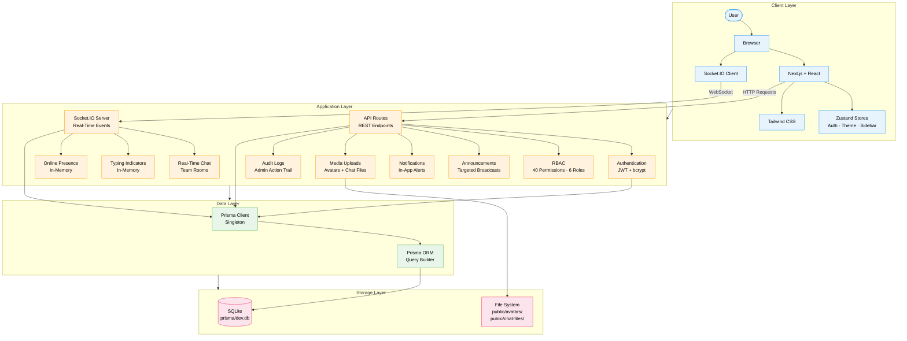

**Flow Types:**
- **HTTP Request Flow:** User → Browser → Next.js → API Routes → Prisma → SQLite
- **WebSocket Real-Time Flow:** User → Browser → Socket.IO Client → Socket.IO Server → Prisma → SQLite
- **Media Flow:** API Routes → File System (avatars, chat files)

### Technology Stack Summary

| Layer | Technology |
|---|---|
| Frontend | Next.js 16.2.10 + React 19.2.4 + TypeScript 5 |
| State Management | Zustand 5.0.14 |
| Styling | Tailwind CSS 4 |
| Real-Time | Socket.IO 4.8.3 (WebSocket + polling fallback) |
| ORM | Prisma 6.19.3 |
| Database | SQLite |
| Authentication | JWT (jsonwebtoken) + bcryptjs |
| Storage | Local filesystem (`public/avatars/`, `public/chat-files/`) |
| Validation | Zod 4.4.3 |
| Animation | Framer Motion 12.42.2 |
| Charts | Recharts 3.9.2 |
| Icons | Lucide React 1.25.0 |

### Technology Stack

| Category | Technology | Version |
|---|---|---|
| Runtime | Node.js | 18+ |
| Framework | Next.js | 16.2.10 |
| Language | TypeScript | 5 |
| React | React | 19.2.4 |
| Database | SQLite | — |
| ORM | Prisma | 6.19.3 |
| Real-Time | Socket.IO | 4.8.3 |
| Styling | Tailwind CSS | 4 |
| State | Zustand | 5.0.14 |
| Animation | Framer Motion | 12.42.2 |
| Charts | Recharts | 3.9.2 |
| Validation | Zod | 4.4.3 |
| Icons | Lucide React | 1.25.0 |
| Auth | JWT + bcryptjs | — |
| Container | Docker | Multi-stage |

### External Integrations

| Integration | Status | Notes |
|---|---|---|
| Email (SMTP) | Not implemented | Future roadmap |
| OAuth (Google, GitHub) | Not implemented | Future roadmap |
| Cloud storage (S3) | Not implemented | Uses local filesystem |
| CDN | Not implemented | Served via Next.js |
| Monitoring (Sentry) | Not implemented | Console logging only |
| CI/CD (GitHub Actions) | Not implemented | Manual deployment |

### Glossary

| Term | Definition |
|---|---|
| **RBAC** | Role-Based Access Control — permission system based on user roles |
| **JWT** | JSON Web Token — stateless authentication token |
| **Socket.IO** | Real-time bidirectional communication library |
| **Kanban** | Visual task management board with status columns |
| **Prisma** | TypeScript-first database ORM |
| **Turbopack** | Next.js bundler for fast development and builds |
| **Workspace** | Top-level organizational container for teams and projects |
| **Audit Trail** | Complete log of all system mutations for compliance |
| **Feature Flag** | Runtime toggle for enabling/disabling features |

### Acronyms

| Acronym | Full Form |
|---|---|
| API | Application Programming Interface |
| CORS | Cross-Origin Resource Sharing |
| CSRF | Cross-Site Request Forgery |
| CRUD | Create, Read, Update, Delete |
| DB | Database |
| HTTP | Hypertext Transfer Protocol |
| HTTPS | HTTP Secure |
| ORM | Object-Relational Mapping |
| RBAC | Role-Based Access Control |
| REST | Representational State Transfer |
| SQL | Structured Query Language |
| SSL | Secure Sockets Layer |
| TLS | Transport Layer Security |
| WCAG | Web Content Accessibility Guidelines |
| XSS | Cross-Site Scripting |

---

*This document is implementation-focused and reflects the current state of the Pulse codebase. Cross-reference with `README.md` for setup instructions, `DESIGN.md` for UI specifications, and `file.md` for project structure.*
